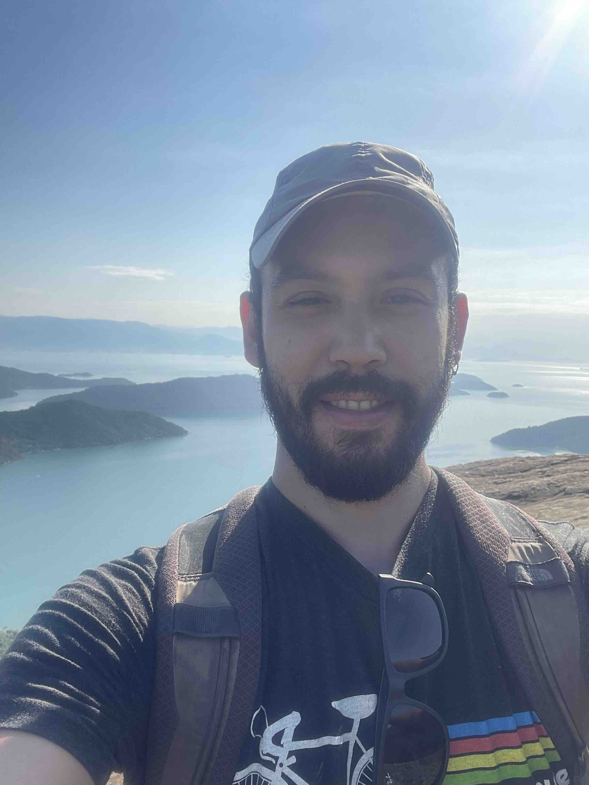
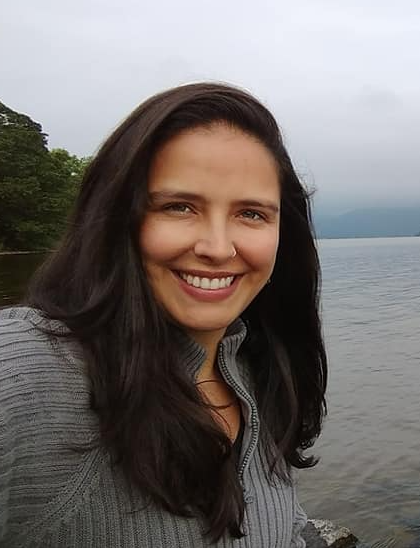

Olá!

Obrigado pelo interesse em participar da disciplina "Boas Práticas e Ferramentas
    da Ciência Aberta na Ecologia". Nesta disciplina serão abordados conceitos
    teóricos, tendências e ferramentas computacionais para desenvolver pesquisas
    que vão ao encontro dos princípios e movimento da ciência aberta. 

Este sítio servirá como um guia para nossas aulas. Nele vocês encontrarão os
    materiais necessários bem
    como os scripts que utilizaremos durante as aulas para as atividades
    práticas. Ah! O site continuará funcionando após o término da disciplina,
    portanto, sempre que tiver alguma dúvida é só voltar aqui e revisitar o que
    vimos nas aulas.
    
[Clique aqui]() para uma visão completa do cronograma

# Ministrantes

O curso será ministrado presencialmente por Gabriel Nakamura. Porém, este curso
    foi concebido em conjunto com a Melina Leite

## Gabriel

```{r echo=FALSE,eval=TRUE,out.width="20%"}

```

Sou formado em licenciatura em Ciências Biológicas (apesar da dúvida entre Ciências
    Sociais e História), fiz algumas andanças de difícil reprodutibilidade para
    obter o mestrado (Ecologia e Conservação UFMS) e doutorado (Ecologia UFRGS).
    Após um tempo fora (posdoc Texas A&M University), a saudade do pequi e da
    guariroba do cerrado falou mais alto e retornei como posdoc da Universidade
    Federal de Goiás no INCT-EECBio e depois como posdoc na Universidade de São
    Paulo (USP). Atualmente sou professor na Universidade Federal de Minas
    Gerais (UFMG). Venho desenvolvendo  métodos e ferramentas computacionais em
    macroecologia e macroevolução.
    [Aqui](http://lattes.cnpq.br/2456515948049565) um pouquinho mais do que
    venho desenvolvendo.

## Melina

```{r echo=FALSE,eval=TRUE,out.width="20%"}

```

Sou ecóloga e cientista de dados na Universidade de Regemsbirg. Tenho graduação
    em biologia (UFRJ), mestrado (UFRJ) e doutorado em Ecologia (USP). Acumulei
    também um MBA em Gestão Ambiental (Poli-USP) e MBA em Ciência de Dados
    (ESALQ-USP). Ao longo dos anos trabalhei em diferentes áreas da ecologia e
    biologia da conservação como ecologia da paisagem, de comunidades, de
    populações e ecologia aplicada. Tenho bastante interesse na aplicação
    métodos estatísticos para descobertas ecológicas (modelos mistos são meu
    xodó). Adoro escalada, trilhas e esportes de aventura no geral! Ah, e sou
    uma entusiasta do movimento da **Ciência Aberta**!! Para me achar e saber
    mais sobre mim, veja meu [site](https://melinaleite.weebly.com/).


