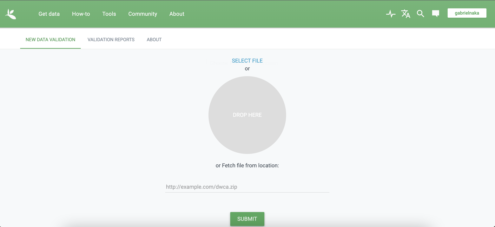

Dados são a **base** de quase toda pesquisa ecológica e podem ser de natureza, formatos e tamanhos muito diferentes: tabelas, questionários, texto, imagem, áudio, entrevista, simulações, etc...

Dados são **produto da pesquisa**, assim como teses e artigos. Portanto, devemos nos orgulhar dos dados que produzimos/coletamos/simulamos/organizamos dentro dos nossos projetos de pequisa!

Nessa aula vamos navegar no universo dos dados ecológicos, discutindo um pouco sobre:

-   Porque precisamos de dados abertos, ou minimamente abertos - fraudes como fabricação/falsificação de dados

-   Longevidade dos dados - resgate de dados

-   Plano de gestão de dados

-   Boas práticas de organização e gestão de dados tabulares

-   Importância dos metadados

-   Vantagens em deixar dados abertos

-   Barreiras para o compartilhamento de dados

-   Princípios FAIR (Findable, Accessible, Interoperable and Reusable)

-   Publicação de dados em repositórios e/ou revistas científicas

-   Tipos de repositórios

-   Licenças

-   Ética na publicação de dados

# Algumas revistas de dados

Base de dados sobre políticas de dados de revistas em Ecologia e Evolução:

-   Berberi I, Roche D (2021) Living database of journal data policies in E&E. <https://doi.org/10.17605/OSF.IO/D6SP3>

Listas de revistas de dados (*Data journals*):

-   <https://zenodo.org/record/7082126>

-   <https://libguides.wmich.edu/datasci/datajournals>

Algumas revistas que publicam dados ou metadados extendidos de pesquisas

-   [Data Papers](https://esapubs.org/archive/) nas revistas da ESA (Ecological Society of America)

-   [Data in Brief](https://www.journals.elsevier.com/data-in-brief) (da Elsevier): várias disciplinas

-   [Scientific Data](https://www.nature.com/sdata/) (da Springer Nature): várias disciplinas

Exemplo de *data papers* em ecologia: 15 artigos de dados sobre biodiversidade da Mata Altântica publicados na *Ecology:*

-   [ATLANTIC: Data Papers from a biodiversity hotspot](https://esajournals.onlinelibrary.wiley.com/doi/toc/10.1002/(ISSN)1939-9170.AtlanticPapers)

# Alguns repositórios de dados

Listas de vários repositórios de dados:

-   <https://oad.simmons.edu/oadwiki/Data_repositories>

-   <https://clarivate.com/webofsciencegroup/master-data-repository-list/>

### Temáticos

-   [Movebank](https://www.gbif.org/): dados de movimento animal

-   [GBIF](https://www.gbif.org/)

-   [KNB](https://knb.ecoinformatics.org/) (Knowledge Network for Biocomplexity)

-   [bioTIME](https://biotime.st-andrews.ac.uk/): global database of assemblage time series for quantifying and understanding biodiversity change

-   [Environmental Data Initiative](+(<https://edirepository.org/>)

### Genéricos/gerais:

-   [Figshare](https://figshare.com/)

-   [Zenodo](https://zenodo.org/)

-   [Dryad](https://datadryad.org/stash)

-   [Mendeley Data](https://data.mendeley.com/)

-   [Open Science Framework](https://osf.io/)

-   [Dataverse](http://dataverse.org/)

-   [Eudat](https://eudat.eu/)

### Institucionais

-   [USP](https://repositorio.uspdigital.usp.br/?codmnu=9980)

### Redes de pesquisa/pesquisadores

Alguns exemplos em ecologia de florestas quem mantém estrutura de dados compartilhados entre membros da rede (e externos mediante certas condições).

-   [ForestGEO](https://forestgeo.si.edu/): dados de algumas parcelas são abertos (ex: Barro Colorado Island), outros você solicita mediante prenchimento de formulário no site, outros diretamente com os PI (principal investigators)

-   [Amazon Tree Diversity Network](https://sites.google.com/naturalis.nl/amazon-tree-diversity-network/about-us)

-   [ForestPlots.Net](https://forestplots.net/)

# Buscadores/agregadores de dados

-   [Metabuscador](https://metabuscador.uspdigital.usp.br/) das instituições do estado de São Paulo.

-   [re3data](https://www.re3data.org/) (Registry of Research data Repositories)

-   [DataONE](https://www.dataone.org/what-dataone)

-   [DataCite](https://commons.datacite.org/)

-   [Google Dataset Search](https://datasetsearch.research.google.com/)

-   [OpenAIRE Explore](https://explore.openaire.eu/search/find/research-outcomes?type=%22datasets%22)

# Construindo metadados em formato EML

## Metadados

Os metadados consistem em explicações sobre a estrutura de dados. Por exemplo,
   o significado dos códigos ou abreviações presentes em uma data tabela, do
   que se trata a informação presente nas linhas e nas colunas, o que uma dada
   função faz. Reportar precisamente o que cada arquivo contém é de extrema
   importância para garantir com que outras pessoas, ou mesmo o você do futuro
   saiba o que foi/está sendo feito no projeto científico.

Os metadados não servem apenas para reportar o significado das variáveis em
    tabelas, isso por si só já seria um motivo relevante para termos metadados,
    mas também para facilitar a integração de bases diferentes de dados.
    Imagine só ter que navegar manualmente nos metadados de estudos de
    diferentes grupos, com dados coletados com diferentes métodos, tabelas que
    adotam diferentes códigos, com distantas escalas espaciais e temporais. Até
    seria possível, mas talvez a taxa com que perdemos espécies e habitats seja
    mais rápida (e está sendo) que nossa capacidade de síntese de dados.
    Portanto, os metadados não servem apenas para o nosso interesse próprio de
    organização, mas ao utilizarmos os metadados estamos contribuindo para um
    avanço mais rápido do processo científico.

Dada tais importâncias citadas acima, os metadados ideais devem seguir um
   esquema onde podem ser lidos por humanos (human-readable) e por computadores
   (machine-readable). Desta forma, nesta seção vamos praticar a elaboração de
   metadados que seguem essa característica, e que o formato foi pensado para
   satisfazer as especificidades dos dados ecológicos. Para tanto vamos
   utilizar o pacote EML. 
   
# Metadados na prática - utilizando o pacote `{EML}`

Vamos agora construir um metadado utilizando o pacote EML (Ecological Metadata
    Language). O pacote EML foi desenvolvido com o intuito de oferecer um
    conjunto de funções que permite a construção de metadados do tipo XML mas
    que abrangem as especificidades presentes nos dados ecológicos. Para
    relembrar a estrutura dos metadados peço que revejam os slides dessa aula
    [aqui](https://gabrielnakamura.github.io/USP_BIE5798_apresentacoes/#33).


Nesta seção temos duas opções de prática. Aqueles que fizeram os metadados em
    palnilhas eletrônicas, podem praticar com seus próprios dados. Para aqueles
    que não tem dados próprios iremos utilizar o conjunto de dados do artigo
    ["Organic-matter loading determines regime shifts and alternative states in
    an aquatic ecosystem"](https://www.pnas.org/doi/10.1073/pnas.1221037110)
    para construir um arquivo de metadados. Optamos por usar este dado pois ele
    já apresenta um arquivo de metadados associado, assim podemos reconstruí-lo
    e verificar como fica. Além disso ele é o mesmo dado utilizado no tutorial
    original do pacote EML, sendo conveniente para fins didáticos. Ao final
    vamos praticar com um outro conjunto de dados. Lembrando que se você baixou
    o repositório do material desta disciplina, você conseguirá ler os dados
    sem problemas.


## Instalação

Para instalar o pacote EML faça o seguinte:

```{r echo=TRUE,eval=FALSE}
install.packages("EML")

library(EML)
```

Vamos utilizar um conjunto de dados contidos no próprio pacote EML para
    facilitar a compreensão dos passos necessários para construir um EML
    completo

## Construindo um EML - Harvard Forest Data 

### Construindo os Atributos

Os atributos são as descrições para as variáveis contidas na nossa tabela.
    Aquela aba contendo as informações das variáveis, pois então, esta seria os
    atributos da sua tabela de dados. Então, primeiro precisamos de uma tabela
    de atributos que define o significado geral de cada variável em nossa
    tabela de dados. Esta tabela pode ser gerada aqui no R direto, como no
    exemplo abaixo, mas pode ser importada a partir de uma tabela `.csv`. A
    tabela segue o formato a seguir:

```{r}
attributes <-
tibble::tribble(
~attributeName, ~attributeDefinition,                                                 ~formatString, ~definition,        ~unit,   ~numberType,
  "run.num",    "which run number (=block). Range: 1 - 6. (integer)",                 NA,            "which run number", NA,       NA,
  "year",       "year, 2012",                                                         "YYYY",        NA,                 NA,       NA,
  "day",        "Julian day. Range: 170 - 209.",                                      "DDD",         NA,                 NA,       NA,
  "hour.min",   "hour and minute of observation. Range 1 - 2400 (integer)",           "hhmm",        NA,                 NA,       NA,
  "i.flag",     "is variable Real, Interpolated or Bad (character/factor)",           NA,            NA,                 NA,       NA,
  "variable",   "what variable being measured in what treatment (character/factor).", NA,            NA,                 NA,       NA,
  "value.i",    "value of measured variable for run.num on year/day/hour.min.",       NA,            NA,                 NA,       NA,
  "length",    "length of the species in meters (dummy example of numeric data)",     NA,            NA,                 "meter",  "real")
```

Dê uma olhada na tabela de atributos (pode ser feito usano a função `View` ou
    abrindo no Excel). A maioria dos dados seguem este formato geral.

A seguir precisamos descrever os atributos que apresentam níveis. Por exemplo o
    atributo chamado `variable` apresenta oito níveis. A estratégia seguida
    aqui foi criar vetores com os códigos usados para cada nível dos atributos
    e uma pequena explicação.

```{r echo=TRUE,eval=FALSE}
i.flag <- c(R = "real",
            I = "interpolated",
            B = "bad")
variable <- c(
  control  = "no prey added",
  low      = "0.125 mg prey added ml-1 d-1",
  med.low  = "0,25 mg prey added ml-1 d-1",
  med.high = "0.5 mg prey added ml-1 d-1",
  high     = "1.0 mg prey added ml-1 d-1",
  air.temp = "air temperature measured just above all plants (1 thermocouple)",
  water.temp = "water temperature measured within each pitcher",
  par       = "photosynthetic active radiation (PAR) measured just above all plants (1 sensor)"
)

value.i <- c(
  control  = "% dissolved oxygen",
  low      = "% dissolved oxygen",
  med.low  = "% dissolved oxygen",
  med.high = "% dissolved oxygen",
  high     = "% dissolved oxygen",
  air.temp = "degrees C",
  water.temp = "degrees C",
  par      = "micromoles m-1 s-1"
)

## Write these into the data.frame format
factors <- rbind(
data.frame(
  attributeName = "i.flag",
  code = names(i.flag),
  definition = unname(i.flag)
),
data.frame(
  attributeName = "variable",
  code = names(variable),
  definition = unname(variable)
),
data.frame(
  attributeName = "value.i",
  code = names(value.i),
  definition = unname(value.i)
)
)
```

Após especificadas as características das variáveis categóricas (as contínuas
    já estão especificadas na tabela geral de atributos `attributes`), usamos a
    função `set_attributes` para criar a lista de atributos geral dos dados,
    onde devemos especificar o tipo de atributo que estamos inserindo (se
    caracter, se data, se fator etc..)

```{r echo=TRUE,eval=FALSE}
attributeList <- set_attributes(attributes, factors, col_classes = c("character", "Date", "Date", "Date", "factor", "factor", "factor", "numeric"))
```

### Construindo as características físicas do dado

Aqui vamos especificar as características físicas do próprio arquivo de dados
    que utilizamos, ou seja, o formato, o tipo de compressão do arquivo, o
    separador etc. Resumindo, aqui é especificado a **característica do arquivo**. Isso é feito facilmente com a função `set_physical`. Se estivermos
    utilizando um arquivo .csv a função já extrai automaticamente a maior parte
    das características relevantes do arquivo de dados.

```{r echo=TRUE,eval=FALSE}
physical <- set_physical(here::here("data", "hf205-01-TPexp1-EML-Exemple.csv"))
```

### Juntando Atributos e Características físicas

Com o objeto de atributos e o objeto de características físicas temos o
    essencial para descrever o nosso conjunto de dados. Agora vamos juntar
    ambos com mais algumas informações em uma única lista e denominar isso como
    sendo o nosso `dataTable`

```{r echo=TRUE,eval=FALSE}

dataTable <- list(
                 entityName = "hf205-01-TPexp1.csv",
                 entityDescription = "tipping point experiment 1",
                 physical = physical,
                 attributeList = attributeList)
```

### Características adicionais - extensão geográfica, métodos e outros


```{r echo=TRUE,eval=FALSE}
geographicDescription <- "Harvard Forest Greenhouse, Tom Swamp Tract (Harvard Forest)"


coverage <- 
  set_coverage(begin = '2012-06-01', end = '2013-12-31',
               sci_names = "Sarracenia purpurea",
               geographicDescription = geographicDescription,
               west = -122.44, east = -117.15, 
               north = 37.38, south = 30.00,
               altitudeMin = 160, altitudeMaximum = 330,
               altitudeUnits = "meter")


```


Para descrever os métodos em metadados

```{r echo=TRUE,eval=FALSE}

methods_file <- here::here("data", "hf205-methods.docx")
methods <- set_methods(methods_file)
```

Identificação dos indivíduos endereço e outras informações sobre contatos

```{r echo=TRUE,eval=FALSE}
R_person <- person("Aaron", "Ellison", ,"fakeaddress@email.com", "cre", 
                  c(ORCID = "0000-0003-4151-6081"))
aaron <- as_emld(R_person)
others <- c(as.person("Benjamin Baiser"), as.person("Jennifer Sirota"))
associatedParty <- as_emld(others)
associatedParty[[1]]$role <- "Researcher"
associatedParty[[2]]$role <- "Researcher"

HF_address <- list(
                  deliveryPoint = "324 North Main Street",
                  city = "Petersham",
                  administrativeArea = "MA",
                  postalCode = "01366",
                  country = "USA")

publisher <- list(
                 organizationName = "Harvard Forest",
                 address = HF_address)


contact <- 
  list(
    individualName = aaron$individualName,
    electronicMailAddress = aaron$electronicMailAddress,
    address = HF_address,
    organizationName = "Harvard Forest",
    phone = "000-000-0000")
```


criando keywords para os dados

```{r echo=TRUE,eval=FALSE}
keywordSet <- list(
    list(
        keywordThesaurus = "LTER controlled vocabulary",
        keyword = list("bacteria",
                    "carnivorous plants",
                    "genetics",
                    "thresholds")
        ),
    list(
        keywordThesaurus = "LTER core area",
        keyword =  list("populations", "inorganic nutrients", "disturbance")
        ),
    list(
        keywordThesaurus = "HFR default",
        keyword = list("Harvard Forest", "HFR", "LTER", "USA")
        ))
```
Outras informações relevantes como abstract etc

```{r echo=TRUE,eval=FALSE}
pubDate <- "2012" 

title <- "Thresholds and Tipping Points in a Sarracenia 
Microecosystem at Harvard Forest since 2012"

abstract <- "The primary goal of this project is to determine
  experimentally the amount of lead time required to prevent a state
change. To achieve this goal, we will (1) experimentally induce state
changes in a natural aquatic ecosystem - the Sarracenia microecosystem;
(2) use proteomic analysis to identify potential indicators of states
and state changes; and (3) test whether we can forestall state changes
by experimentally intervening in the system. This work uses state-of-the
art molecular tools to identify early warning indicators in the field
of aerobic to anaerobic state changes driven by nutrient enrichment
in an aquatic ecosystem. The study tests two general hypotheses: (1)
proteomic biomarkers can function as reliable indicators of impending
state changes and may give early warning before increasing variances
and statistical flickering of monitored variables; and (2) well-timed
intervention based on proteomic biomarkers can avert future state changes
in ecological systems."  

intellectualRights <- "This dataset is released to the public and may be freely
  downloaded. Please keep the designated Contact person informed of any
plans to use the dataset. Consultation or collaboration with the original
investigators is strongly encouraged. Publications and data products
that make use of the dataset must include proper acknowledgement. For
more information on LTER Network data access and use policies, please
see: http://www.lternet.edu/data/netpolicy.html."
```

### Criando o arquivo XML

Agora que todas as informações foram criadas (atributos, dados físicos do
    arquivo, coverage, dados de contato), precisamos juntar todas elas em uma
    única lista.

```{r echo=TRUE,eval=FALSE}
dataset <- list(
               title = title,
               creator = aaron,
               pubDate = pubDate,
               intellectualRights = intellectualRights,
               abstract = abstract,
               associatedParty = associatedParty,
               keywordSet = keywordSet,
               coverage = coverage,
               contact = contact,
               methods = methods,
               dataTable = dataTable)
```

Antes de criar o arquivo XML é importante criar um uuid para o arquivo, que
    nada mais é que um identificador que qualquer um pode criar, como
    demonstrado a seguir. Para mais informações sobre o que é um uuid ver 
    [esta explicação no Wikipedia](https://en.wikipedia.org/wiki/Universally_unique_identifier)

```{r echo=TRUE,eval=FALSE}
eml <- list(
           packageId = uuid::UUIDgenerate(),
           system = "uuid", # type of identifier
           dataset = dataset)
```

Finalmente criando o arquivo XML e validando.

```{r echo=TRUE,eval=FALSE}
write_eml(eml, here::here("data", "eml_tutorialHF205.xml"))
eml_validate(here::here("data", "eml_tutorialHF205.xml"))
```


# Metadados para dados de biodiversidade

Se você ainda não passou pela seção de metadados usando o pacote EML, volte um pouco, por favor. Lá apresento uma introdução geral sobre metadados em XML e como montá-los usando o pacote EML no R. Aqui abordarei especificamente como montar arquivos com metadados para dados de biodiversidade (ocorrência, lista de espécies, pontos etc).

## Leituras sugeridas

Esta seção é baseada no documento produzido pelo [Living Norway Project](https://livingnorway.github.io/LivingNorwayR/articles/LNWorkshopExample_TOV-E.html), que também oferece uma introdução muito interessante sobre Darwin Core e metadados para biodiversidade.

## Exemplos de metadados de biodiversidade

O melhor exemplo de esturutura digital que utiliza metadados de biodiversidade construídos desta maneira que mostrarei é o [GBIF](https://www.gbif.org/).

# Metadados na prática - utilizando o pacote `{LivingNorwayR}`

## Instalação e dados

Primeiro vamos instalar o pacote

```{r echo=TRUE,eval=FALSE}
devtools::install_github("https://github.com/LivingNorway/LivingNorwayR")
library(LivingNorwayR)
```

Aqui os dados que serão utilizados no exemplo. Estes são os mesmos dados utilizados no tuturial do Living Norway R. Para mais detalhes visite a [página deles](https://livingnorway.github.io/LivingNorwayR/articles/LNWorkshopExample_TOV-E.html).


```{r echo=FALSE,eval=FALSE}
datasetURL <- "https://ipt.nina.no/archive.do?r=tove_birdsampling"
localDataLoc <- file.path(here::here("data"), "TOVEData.zip") 
download.file(datasetURL, localDataLoc, mode = "wb") # o arquivo foi para a pasta escolhida
```

Vamos utilizar um conjunto de dados que fizemos o download e está dentro da nossa pasta do curso para criar nosso arquivo Darwin Core.

```{r echo=TRUE,eval=FALSE}
# Lendo o arquivo core
TOVEEventTableDF <- read.table(here::here("data", "TOVEData", "event.txt"), sep = "\t", header = TRUE)
head(TOVEEventTableDF)
```

Obtendo os arquivos extendidos, neste caso o arquivo de ocorrência de espécies. Podemos ver que se trata de um simples data frame onde os nomes das colunas seguem os códigos do Darwin Core 

```{r echo=TRUE,eval=FALSE}
TOVEOccTable <- read.table(here::here("data", "TOVEData", "occurrence.txt"), sep = "\t", header = TRUE)
head(TOVEOccTable)
```


## Construindo um XML baseado em Darwin Core

Agora que temos nossos dados podemos construir um arquivo do tipo Darwin Core

### Construindo o metadado para a tabela de eventos **core**

Primeiro precisamos definir o que será a tabela **core** e o que serão as suas **extensões**, que por sua vez podem ser mapeadas a partir de atributos comuns presentes em ambas as tabelas (neste caso o ID).

```{r echo=TRUE,eval=FALSE}

# 1. Inicializando automaticamente - só funciona caso os nomes já estejam de acordo com o Darwin Core
newTOVEEventTable <- initializeGBIFEvent(TOVEEventTableDF, "id", nameAutoMap = TRUE)

# 2. Iniciando manualmente - podemos usar o nome dos atributos que correspondem a cada categoria do Darwin Core. 
    # podemos usar o nome ou o número da coluna
newTOVEEventTable <- initializeGBIFEvent(TOVEEventTableDF, "id",
  type = "type",
  modified = "modified",
  datasetName = "datasetName",
  ownerInstitutionCode = "ownerInstitutionCode",
  informationWithheld = "informationWithheld",
  dataGeneralizations = "dataGeneralizations",
  eventID = "eventID",
  samplingProtocol = "samplingProtocol",
  sampleSizeValue = "sampleSizeValue",
  sampleSizeUnit = "sampleSizeUnit",
  samplingEffort = "samplingEffort",
  eventDate = "eventDate",
  eventTime = "eventTime",
  year = "year",
  month = "month",
  day = "day",
  locationID = "locationID",
  country = "country",
  countryCode = "countryCode",
  stateProvince = "stateProvince",
  municipality = "municipality",
  locality = "locality",
  minimumElevationInMeters = "minimumElevationInMeters",
  maximumElevationInMeters = "maximumElevationInMeters",
  decimalLatitude = "decimalLatitude",
  decimalLongitude = "decimalLongitude",
  geodeticDatum = "geodeticDatum",
  coordinateUncertaintyInMeters = "coordinateUncertaintyInMeters")

# Podemos checar se o mapeamento dos termos se deu corretamente
newTOVEEventTable$getTermMapping()
```

### Construindo os metadados para as extensões da tabela core

Neste caso a tabela a extensão que temos da tabela chave é a tabela de ocorrência de espécies. Vamos mapear ela da mesma forma que fizemos para a tabela core

```{r echo=TRUE,eval=FALSE}
# Função para inicialização da tabela
newTOVEOccTable <- initializeGBIFOccurrence(TOVEOccTable, "id", nameAutoMap = TRUE)

# Checando quais eventos foram mapeados na tabela, o que aparece com NA não foi mapeado, ou porque não existe ou porque tem o nome incorreto
newTOVEOccTable$getTermMapping()
```

### Construindo o EML

O último elemento que precisamos para construir nossos metadados para os arquivos de biodiversidade que estamos utilizando é o arquivo EML, que vocês já conhecem. O EML pode ser criado de várias formas. Vimos anteriormente como criar um EML usando o pacote `{EML}`. O pacote `{LivingNorwayR}` oferece uma maneira simples de criar um arquivo XML usando um arquivo `.Rmd`, ou seja, usando o Rmarkdown. Vamos entender os detalhes de um arquivo do tipo Rmd mais adiante, por hora precisamos apenas saber que ele é um arquivo que permite mesclar textos e códigos, além de possibilitar criar tags para seções (Como os títulos num documento Word). Essas tags são utilizadas pelas funções do LivingNorwayR para criar o arquivo XML. Vale notar que isso é mais limitante que criar um XML usando o EML, mas para questões didáticas vamos usar um arquivo .Rmd pronto, que está na pasta de dados deste diretório.

```{r echo=TRUE,eval=FALSE}

createdTOVEMetadata <- initializeDwCMetadata(fileLocation = here::here("data", "TOVEData", "LNWorkshopExample_Metadata.rmd"), fileType = "rmarkdown")

# Exportando o EML
createdTOVEMetadata$exportToEML(file.path(here::here("data", "TOVEData"), "newMetadata.xml"))
```

Este novo metadado precisa ser lido para o R e assim podemos juntá-lo com os outros arquivos

```{r echo=TRUE,eval=FALSE}
newTOVEMetadata <- initializeDwCMetadata(file.path(here::here("data", "TOVEData"), "newMetadata.xml"),
  fileType = "eml" # This line is not required if the file has the ".xml" file extension
)
```


## Juntando todos os arquivos

Agora temos os arquivos necessários para juntar em um único arquivo zipado que pode ser guardado localmente ou submetido em alguma plataforma de dados, por exemplo, GBIF, como ilustrado abaixo

```{r echo=FALSE,eval=TRUE}

```

Para juntar todos os arquivos criados precisamos usar a seguinte função

```{r echo=TRUE,eval=FALSE}
# criando um único arquivo com todos os objetos criados anteriormente
newTOVEArchive <- initializeDwCArchive(newTOVEEventTable, list(newTOVEOccTable), newTOVEMetadata)
```

Para salvar o objeto .zip, que agora é nosso Darwin Core Archive, podemos fazer o seguinte

```{r echo=TRUE,eval=FALSE}
newTOVEArchive$exportAsDwCArchive(file.path(here::here("data", "NEWTOVEData"), "newDwCArchive.zip"))
```


## Explorando o Darwin Core Archive

Uma vez criado o arquivo no formato Darwin Core Archive podemos fazer o caminho inverso e obter as tabelas a partir do arquivo que criamos.

Para tanto podemos usar as funções do pacote LivingNorwayR para ler o arquivo zip e extrair as tabelas, incluindo os metadados.

```{r echo=TRUE,eval=FALSE}
localDataLoc2 <- file.path(here::here("data", "NEWTOVEData"), "newDwCArchive.zip") 
NEWTOVEArchive <- initializeDwCArchive(localDataLoc2, "UTF-8")
```

Podemos agora explorar os dados dentro do arquivo Darwin Core criado nos passos anteriores. Ou seja, podemos retomar os dados e importar para dentro do R para fazer, por exemplo, novas análises

```{r echo=TRUE,eval=FALSE}
# obtendo o dado
NEWTOVEEventTable <- NEWTOVEArchive$getCoreTable()
class(NEWTOVEEventTable)

# Podemos exportar como um dataframe
NEWTOVEEventTableDF <- NEWTOVEEventTable$exportAsDataFrame()

# obtendo dados da tabela extendida
NEWTOVEEventTableDF <- NEWTOVEEventTable$exportAsDataFrame()
# exportando como dataframe
head(NEWTOVEEventTableDF)

```


# Atividade

Para fixar os conceitos apresentados sobre metadados, vamos treinar um pouco
    mais utilizando um outro conjunto de dados. 

Produza um arquivo `.xml` utilizando os dados `iris` do pacote `{ggplot}`.
    Algumas informações nós não temos, por exemplo, a cobertura de coleta, ano
    de coleta etc. Mas para fins de prática vamos inventar essas informações no
    momento de fazer o metadado.

Para acessar os dados:

```{r echo=TRUE,eval=FALSE}
library(ggplot2)
data("iris")
```


## Leituras sugeridas

Para uma introdução mais completa sobre os metadados sugiro
    [este](https://sbclter.msi.ucsb.edu/external/EML/EML_documents/eml_metadata_guide.html) artigo. Para uma introdução da importância dos metadados para
    contruir conjuntos de dados integrados sugiro o artigo de [Jones et al. (2006)](https://www.annualreviews.org/doi/10.1146/annurev.ecolsys.37.091305.110031).
    Para um exemplo de base de dados online que se utiliza das potencialidades dos metadados sugiro visitar o [KNB - Knowledge Network Biocomplexity](https://knb.ecoinformatics.org/about).

## Exemplos de metadados 

Para um exemplo simples de como um metadado se parece veja [aqui](https://github.com/ropensci/EML/blob/master/inst/examples/example-eml-2.1.1.xml). Para um exemplo mais completo sugiro [este arquivo](https://github.com/ropensci/EML/blob/master/inst/examples/hf205.xml).
Esta [introdução](https://www.neonscience.org/resources/learning-hub/tutorials/dc-metadata-importance-eml-r) trazida pelo NEON (National Ecological Observatory) é muito interessante para compreender de maneira geral a importância de metadados para síntese e como eles podem ser obtidos facilmente com auxílio do pacote EML. O [DataOne](https://www.dataone.org/) é uma plataforma de dados que também se utiliza dos arquivos XML para reportar as características gerais dos dados.


# Leituras recomendadas

## Geral

-   Bledsoe E, Burant J, Higino G, Roche D, Binning S, Finlay K, Pither J, Pollock L, Sunday J, Srivastava D (2021) Data rescue: saving environmental data from extinction. <https://doi.org/10.32942/osf.io/ra6ze>

-   Caetano DS, Aisenberg A (2014) Forgotten treasures: the fate of data in animal behaviour studies. Animal Behaviour 98:1--5. <https://doi.org/10.1016/j.anbehav.2014.09.025>

-   Colavizza G, Hrynaszkiewicz I, Staden I, Whitaker K, McGillivray B (2020) The citation advantage of linking publications to research data. PLOS ONE 15:e0230416. <https://doi.org/10.1371/journal.pone.0230416>

-   Culina A, Baglioni M, Crowther TW, Visser ME, Woutersen-Windhouwer S, Manghi P (2018) Navigating the unfolding open data landscape in ecology and evolution. Nat Ecol Evol 2:420--426. <https://doi.org/10.1038/s41559-017-0458-2>

-   Gomes DGE, Pottier P, Crystal-Ornelas R, et al (2022) Why don't we share data and code? Perceived barriers and benefits to public archiving practices. Proceedings of the Royal Society B: Biological Sciences 289:20221113. <https://doi.org/10.1098/rspb.2022.1113>

-   Gurstein MB (2011) Open data: Empowering the empowered or effective data use for everyone? First Monday. <https://doi.org/10.5210/fm.v16i2.3316>

-   Lima RAF, Phillips OL, Duque A, et al (2022) Making forest data fair and open. Nat Ecol Evol 1--3. <https://doi.org/10.1038/s41559-022-01738-7>

-   McIntosh ACS, Cushing JB, Nadkarni NM, Zeman L (2007) Database design for ecologists: Composing core entities with observations. Ecological Informatics 2:224--236. <https://doi.org/10.1016/j.ecoinf.2007.07.003>

-   Mello M (2017) O que é um data paper? -- Sobrevivendo na Ciência. <https://marcoarmello.wordpress.com/2017/09/11/datapaper/>

-   Perkel J (2016) Democratic databases: science on GitHub. Nature 538:127--128. <https://doi.org/10.1038/538127a>

-   Roche DG, Berberi I, Dhane F, Lauzon F, Soeharjono S, Dakin R, Binning SA (2022) Slow improvement to the archiving quality of open datasets shared by researchers in ecology and evolution. Proceedings of the Royal Society B: Biological Sciences 289:20212780. <https://doi.org/10.1098/rspb.2021.2780>

-   Roche DG, Kruuk LEB, Lanfear R, Binning SA (2015) Public Data Archiving in Ecology and Evolution: How Well Are We Doing? PLoS Biol 13:e1002295. <https://doi.org/10.1371/journal.pbio.1002295>

-   Vanz SA de S, Passos PCSJ, Caregnato SE, Pavão CMG, Borges EN, Rocha RP da, Gabriel Junior RF, Azambuja LAB (2018) Acesso aberto a dados de pesquisa no Brasil: práticas e percepções dos pesquisadores: relatório 2018. Universidade Federal do Rio Grande do Sul. <https://lume.ufrgs.br/handle/10183/185195>

-   Vines TH, Albert AYK, Andrew RL, Débarre F, Bock DG, Franklin MT, Gilbert KJ, Moore J-S, Renaut S, Rennison DJ (2014) The Availability of Research Data Declines Rapidly with Article Age. Current Biology 24:94--97. <https://doi.org/10.1016/j.cub.2013.11.014>

-   Westoby M, Falster DS, Schrader J (2021) Motivating data contributions via a distinct career currency. Proceedings of the Royal Society B: Biological Sciences 288:20202830. <https://doi.org/10.1098/rspb.2020.2830>

-   Wilkinson MD, Dumontier M, Aalbersberg IjJ, et al (2016) The FAIR Guiding Principles for scientific data management and stewardship. Sci Data 3:160018. <https://doi.org/10.1038/sdata.2016.18>

-   Global Indigenous Data Alliance (2023) CARE Principles. In: Global Indigenous Data Alliance. <https://www.gida-global.org/care.> Accessed 6 Aug 2023

## Plano de gestão e gestão de dados

-   British Ecological Society (2014) [A guide to data management in ecology and evolution.](http://www.britishecologicalsociety.org/wp-content/uploads/Publ_Data-Management-Booklet.pdf)

-   Data Carpentry Data Carpentry Workshops in Ecology. In: Data Carpentry. <https://datacarpentry.org/lessons/.> Accessed 7 Aug 2023

-   Michener WK (2015) Ten Simple Rules for Creating a Good Data Management Plan. PLOS Computational Biology 11:e1004525. <https://doi.org/10.1371/journal.pcbi.1004525>

-   Strasser C, Cook R, Michener W, Budden A (2012) Primer on Data Management: What You Always Wanted to Know. <https://doi.org/10.5060/D2251G48>

## Organização de dados

-   Broman KW, Woo KH (2017) Data organization in spreadsheets. The American Statistician <https://doi.org/10.1080/00031305.2017.1375989>

-   Wickham H (2014) Tidy Data. Journal o Statistical Software 59. <https://www.jstatsoft.org/article/view/v059i10/v59i10.pdf>

## Metadados

-   Boettiger C, Jones M (2022) EML: Read and Write Ecological Metadata Language Files. <https://docs.ropensci.org/EML/>

-   Jones MB, Schildhauer MP, Reichman OJ, Bowers S (2006) The New Bioinformatics: Integrating Ecological Data from the Gene to the Biosphere. Annu Rev Ecol Evol Syst 37:519--544. <https://doi.org/10.1146/annurev.ecolsys.37.091305.110031>

-   Jones M, O'Brien M, Mecum B, Boettiger C, Schildhauer M, Maier M, Whiteaker T, Earl S, Chong S (2019) Ecological Metadata Language version 2.2.0. <https://doi.org/10.5063/f11834t2>

-   Lortie CJ, Vargas Poulsen C, Brun J, Kui L (2022) Tabular strategies for metadata in ecology, evolution, and the environmental sciences. Ecology and Evolution 12:e9245. <https://doi.org/10.1002/ece3.9245>

-   Video YouTube sobre conversão metadados em tabela [Excel para EML](https://www.youtube.com/watch?v=rn8Uee49LsM) (Kui Li)

-   Smith C (2022) EMLassemblyline: A tool kit for building EML metadata workflows. <https://ediorg.github.io/EMLassemblyline/index.html>

# Extra

Para quem quiser saber um pouco mais sobre a importância de resgate de dados em ecologia nós sugerimos assistir este documentário produzido pela [Gracielle Higino](http://gracielle.science/). Nele o resgate de dados é abordado de maneira sensível e acessível, destacando a importância deste processo para a ciência.


```{r echo=FALSE,eval=TRUE}
vembedr::embed_url("https://vimeo.com/819068030")
```
