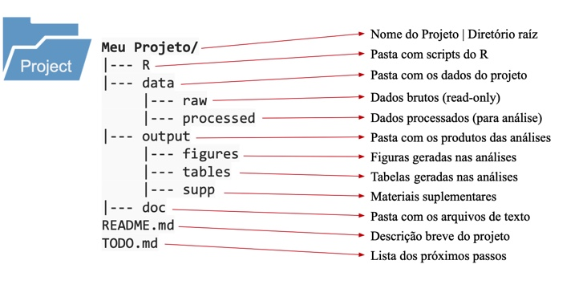
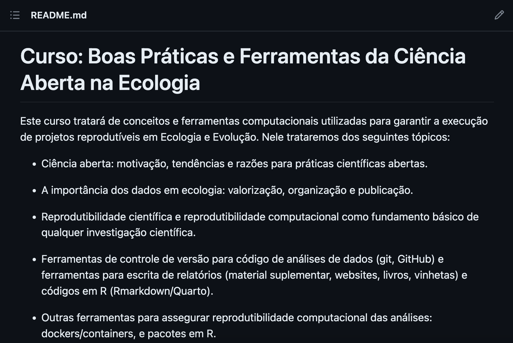
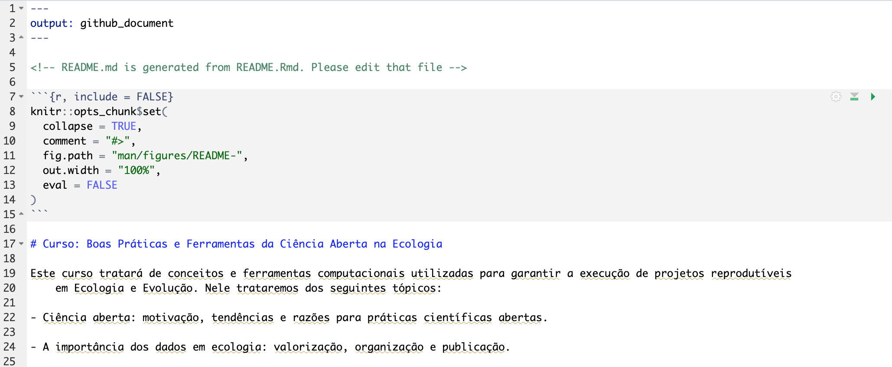
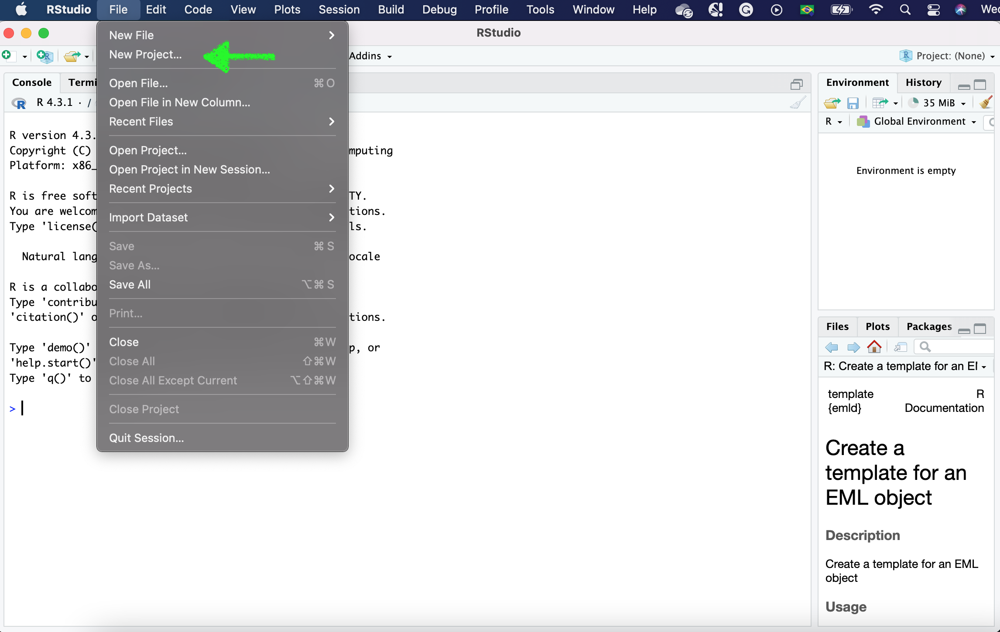
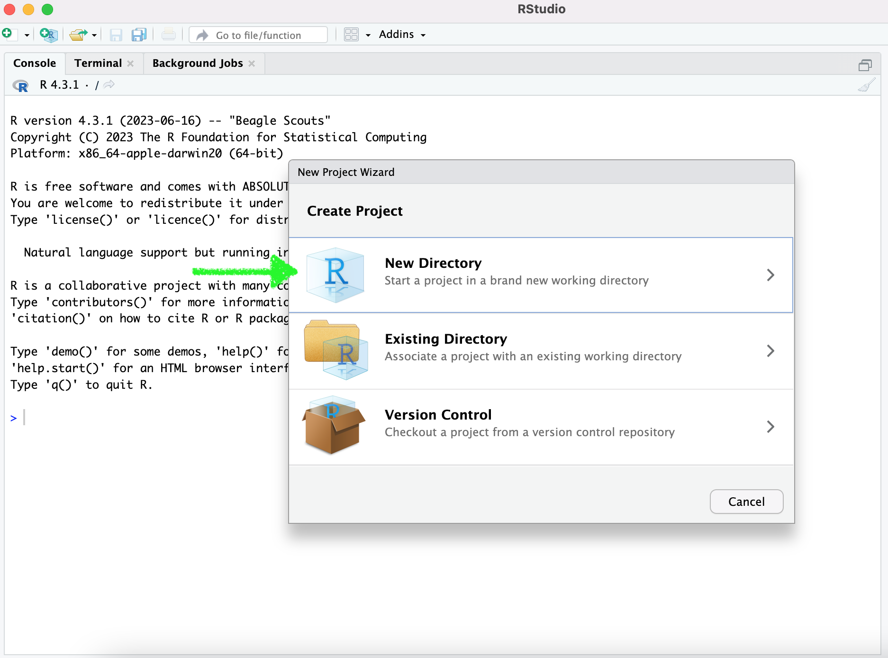
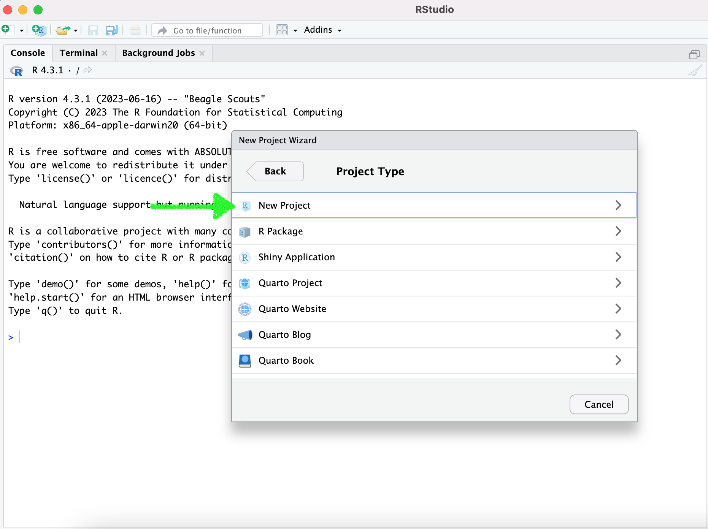
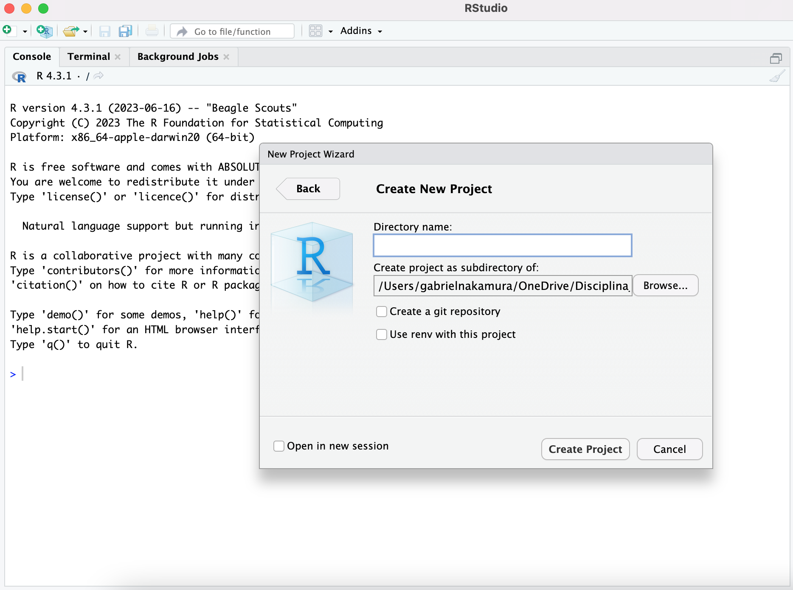

# Organização - questão de estilo?

"Eu me acho na minha bagunça", quem já ouviu essa frase, ou já pronunciou? Provavelmente todos nós. Mas o conceito de **organização** seria mesmo uma questão pessoal? Podemos discutir isso durante horas a fio se estivermos falando do seu quarto, da sua estante ou do seu guarda-roupa, mas quando falamos de ciência, ou seja, uma atividade coletiva, organização **não** é uma questão pessoal, justamente por ser coletiva. Sempre trabalhamos em conjunto, e isso pode ser com um grupo composto por muitas pessoas que trabalham em um determinado projeto, ou pode ser consigo mesmo, o seu eu do futuro. Desta maneira, é necessário que tudo que foi utilizado para o desenvolvimento do seu projeto científico seja de fácil compreensão para seus colaboradores ou para o seu "eu" do futuro.

# Dados necessários para as práticas

Nesta seção vamos utilizar os dados do pacote `{palmerpenguins}`. Que apesar de estar disponível como pacote, portanto poderia ser lido automáticamente apenas baixando o pacote, vamos importar os dados a partir do nosso computador. Vamos fazer isso pois assim podemos demonstrar boas práticas na leitura de dados, scripts e organização do nosso repositório local de maneira geral. Os dados do pacote já estão no repositório que baixaram. Mais adiante vamos utilizá-lo, mas antes vamos ver esquemas gerais de organização de repositório local

# Um esquema geral (mas não absoluto) para organização do diretório local

Nessa seção irei mostrar uma proposta de esquema geral para organização de diretórios. Essa estrutura é baseada nesta proposta do [Gustavo Paterno](https://docs.google.com/presentation/d/1Px9Npa_ANqmmfjCXo9A-eBmWzgUmmkCKd7fBIq_gG6k/edit#slide=id.g62fc6bf72f_0_196).

Digo que não é absoluto pois modificações nesse esquema podem ser feita para ajustar ao conjunto de dados de cada pessoa. A Ecologia é um campo muito amplo de pesquisa, e nem todos os dados se ajustarão perfeitamente a esta proposta. O mais importante de tudo é que os dados estejam organizados de uma maneira **intuitiva** (lida por máquinas, humanos e ordenado) e **consistente** no diretório, como o da figura seguinte.

```{r echo=FALSE,eval=TRUE,fig.cap="Um modelo geral de organização do diretório local, baseado no material do [Gustavo Paterno](https://docs.google.com/presentation/d/1Px9Npa_ANqmmfjCXo9A-eBmWzgUmmkCKd7fBIq_gG6k/edit#slide=id.g62fc6bf72f_0_196)"}

```

Mas, qual a lógica por trás da organização desse diretório? Nesta proposta os arquivos dentro de um projeto são organizados em 4 pastas que contemplam quase todos os documentos que geramos ou que precisamos quando estamos desenvolvendo um projeto científico:

-   `R`: pasta contendo scripts e funções para análises. Aqui descrevemos como R pois grande parte deste material é pensado em usuários deste programa, mas essa pasta poderia ser de outro software de análises.
-   `data`: pasta contendo os dados necessários para as análises. Aqui vale a pena a divisão em duas outras pastas: - `raw`: dados brutos, apenas para leitura (read-only), mas não serão realizadas modificações nestes dados. Isso garante que seu dado bruto sempre se mantenha preservado. - `processed`: dados processados a partir de scripts e do dado bruto contido em `raw`
-   `output`: pasta contendo o resultado de análises, podendo ser figuras, tabelas arquivos do tipo .rds (para guardar objetos vindos do R), entre outros.
-   `docs`: pasta contendo arquivos de texto, preferencialmente arquivos dinâmicos como rmarkdown ou quarto, que podem ser versionados de maneira muito mais eficientes que arquivos de outros softwares.
-   `README`: arquivo de descrição detalhada sobre a estrutura, o conteúdo e a forma de uso do repositório/diretório
-   `.gitignore`: arquivo especial, apesar de não estar presente na ilustração vamos ver que seu uso é bem importante no [versionamento]()

Vale destacar mais uma vez que esse esquema se trata apenas de um modelo geral que pode ser adaptada para que se adeque bem a diferentes projetos, principalmente projetos de pesquisa.

## O README {#sec-readme}

O `README` é uma das partes mais importantes do seu diretório, ele é escrito em caixa alta justamente para que a pessoa que esteja acesssando o seu diretório ouça em voz alta **Me leia, por favor!!**.

Neste arquivo de texto você irá encontrar as principais instruções sobre a estrutura do diretório, incluindo os nomes das pessoas que montaram o diretório, além de instruções básicas sobre o que contém em cada pasta. [Aqui você pode encontrar dicas de como o README contendo as informações básicas necessárias que ele deve conter e porque](https://www.makeareadme.com/). [Aqui um template que pode ser adaptado para os seus propósitos](https://github.com/jehna/readme-best-practices/blob/master/README-default.md). [Aqui algumas dicas interessantes em português](https://blog.rocketseat.com.br/como-fazer-um-bom-readme/). Por fim [nesse repositório](https://github.com/matiassingers/awesome-readme) você pode encontrar alguns exemplos interessantes de arquivos README para diferentes tipos de projetos

É importante saber que você não irá encontrar o modelo final para o README perfeito. Os detalhes de cada README vão variar dependendo do projeto que está desenvolvendo e a forma como ele deve ser apresentado ao usuário. Por exemplo, se o projeto se trata de um repositório de arquivos e scripts de um manuscrito, e não de um README de um projeto de software, não precisa haver alguns campos de explicação, tais como exemplo de uso ou antigas versões de lançamento. Aqui coloco um [*checklist* adaptado](https://github.com/hackergrrl/art-of-readme/edit/master/README-pt-BR.md) de itens que julgo essenciais para um README informativo. Pense no seu trabalho, adicione ou edite esse checklist de acordo com seus propósitos.

Minha proposta de checklist:

-   [ ] Uma linha explicando o propósito do repositório
-   [ ] Autores do repositório
-   [ ] Ligações e contextualizações necessárias (por exemplo, se o repositório está ligado a um artigo científico ou documento técnico)
-   [ ] Instruções de instalação (se for um pacote, por exemplo), uso ou download
-   [ ] Exemplo de utilização, claro e *executável*, principalmente se estivermos falando de uma base de dados, pacote ou utilizar ferramentas de controle como `renv` ou `docker`
-   [ ] Estrutura detalhada de pastas e scripts (o que cada pasta contém, o que cada script faz, o significado das variáveis nas tabelas de dados, etc.)
-   [ ] Status do projeto (finalizado/em andamento)
-   [ ] Em caso de problema com algo no repositório, como reportar (Usar o GitHub issues é uma boa ideia)
-   [ ] Licença que determina a forma como o repositório pode ser utilizado por outras pessoas. Existem inúmeras licenças, para saber melhor quais delas funcionam melhor para o seu repositório veja [esse documento](https://docs.github.com/en/repositories/managing-your-repositorys-settings-and-features/customizing-your-repository/licensing-a-repository)

## Iniciando o README

Duas opções para montar o arquivo README. Primeira, montar você mesmo. O arquivo pode ser montado em um bloco de notas e deve ser nomeado como `README.md`. A extensão `.md` é importante aqui, ela significa que é um arquivo do tipo **Markdown**. Neste momento é importante saber que o arquivo Markdown é apenas um arquivo de texto simples de um tipo chamado **linguagem de marcação** (*markup language*), que permite especificar a estrutura e a formatação da estrutura de um documento a partir do uso de *tags* e outros códigos. Vamos abordar em detalhes como elaborar documentos em Markdown, como este que você lê neste momento, mais adiante. Por hora é importante saber que o README deve ser em markdown pois assim o GitHub idenfica corretamente este documento como sendo o arquivo a ser exibido na página inicial do repositório remoto, como ilustrado na figura abaixo.

```{r echo=FALSE,eval=TRUE,fig.cap="Arquivo README correspondente ao repositório deste site"}

```

Na realidade, o arquivo fonte tem essa aparência

```{r echo=FALSE,eval=T,fig.cap="Arquivo fonte para o README acima mostrado"}

```

Mostro como podemos montar um README @sec-readme. Por enquanto vamos fazer o mais simples.

1- Abra um editor de texto (recomendo o [Obsidian](https://obsidian.md/), mas o editor nativo do seu computador funciona bem também).

2- Digite qualquer título na primeira linha que se inicie com `# Meu Título`.

3- Salve o arquivo com o nome de `README.md` em algum local do seu computador. Por enquanto é isso.

Na seção [Documentos dinâmicos]() veremos como fazer um README a partir de um documento quarto, que é muito mais versátil.

# Ferramentas para organização do diretório local

## Iniciando um projeto com o RStudio

Como vimos na aula teórica @sec-slides, o RStudio possibilita enraizar o projeto, desta forma não precisamos utilizar caminhos absolutos, tornando nossa vida mais fácil e o trabalho mais reprodutível para quem tentar utilizar nosso repositório. Portanto, o primeiro passo vai ser iniciar um novo projeto com o RStudio. Para isso faça o seguinte:

1- Abra o RStudio

2- Em `Arquivo`, selecione `Novo Projeto`, como mostrado abaixo

```{r echo=FALSE,eval=TRUE,fig.cap="Iniciando um projeto",out.width="80%"}

```

3- Na janela que se abriu selecione `Novo Diretório` para iniciar o projeto em um diretório novo

```{r echo=FALSE,eval=TRUE,fig.cap="Iniciando um projeto em um novo diretório",out.width="80%"}

```

4- Escolha o tipo de projeto, neste caso `novo projeto` (se apenas um projeto, ou um pacote ou um aplicativo shiny)

```{r echo=FALSE,eval=TRUE,out.width="80%"}

```

5- Por fim escolha o nome para o diretório e onde ele vai estar no seu computador

```{r echo=FALSE,eval=TRUE,out.width="80%"}

```

Pronto, uma nova janela do RStudio se abrirá, indicando que seu projeto foi iniciado com sucesso. A partir de agora, para abrir o R e realizar modificações de scripts basta clicar no arquivo `.RProject` que leva o nome que deu ao diretório.

## Pacotes para inicialização automática (alternativa)

Alguns pacotes auxiliam montar automaticamente a organização do seu diretório local, por exemplo essa [ferramenta elaborado pelo Carl Boettiger](https://github.com/cboettig/template) e [essa do Francisco Rodriguez-Sanchez](https://github.com/Pakillo/template).

Vamos explorar um pouco a funcionalidade do pacote `{template}`. Para tanto precisamos primeiro instalar o pacote que está hospedado no GitHub.

```{r echo=T,eval=FALSE}
# install.packages("remotes")
remotes::install_github("Pakillo/template")
```

Em seguida vamos ler o pacote e iniciar um novo projeto

```{r echo=TRUE,eval=FALSE}
library("template")
new_project(name = "treegrowth", path = "caminho/para/diretório")
```

O diretório será iniciado no local indicado pelo argumento `path` na função `new_project`.

::: callout-note
Apesar da facilidade que essas ferramentas para inicialização automática dos repositório nos oferecem, minha sugestão é que você organize manualmente seu diretório, pelo menos no início, para pensar cuidadosamente na estrutura das pastas que serão necessárias.
:::

## Here

O `{here}` é o melhor pacote para padronizar caminhos. Sabe aquele erro de leitura dos dados por conta de um `/` ou `\`, ou por ter esquecido ou errado na digitação daquele caminho gigantesco para o arquivo desejado? Com o `{here}` nada disso vai acontecer.

Para demonstrar o uso do pacote here vamos ler os dados `palmer-penguins.txt` para o R. Lembrando, abra o R a partir do .Rproject dentro do diretório que iniciamos nos passos anteriores

```{r echo=TRUE,eval=FALSE}
# caso não tenha o here instalado ainda
# install.packages("here")

library(here)

```

Da maneira convencional poderíamos ler esse dado da seguinte forma:

```{r echo=TRUE,eval=FALSE}
data_penguins <- read.csv("/Users/gabrielnakamura/OneDrive/Disciplina_Praticas_ferramentas_gestao_dados/USP_reproducibility_BIE5791/data/data-penguins.csv")
```

Será que você consegue reproduzir essa simples leitura de dados usando o mesmo código acima? Tente..

Após a tentativa fica claro que não é possível realizar essa leitura de dados. Mas vamos lembrar que temos o projeto que enraiza nossa pasta, então podemos apenas usar o seguinte código

```{r echo=TRUE,eval=FALSE}
data_penguins <- read.csv("aulas/organizacao_local_caminhos/dados-exemplo/data-penguins.csv")
```

Funcionou? Ou apenas para alguns?

Imagino que pode ter funcionado para todos que tem o computador onde a máquina reconhece `/` como separador de caminhos, porém, aqueles que precisa de `\` para informar a separação dos caminhos não deve ter tido sucesso. Como resolvemos isso?

Aí entra o here. Com o pacote here podemos usar simplesmente o seguinte código

```{r echo=TRUE,eval=FALSE}
library(here)
data_penguins <- 
  read.csv(here::here("aulas",
                      "organizacao_local_caminhos",
                      "dados-exemplo",
                      "data-penguins.csv")
  )
data_penguins
```

Note que ao invés de usarmos o caminho, usamos dentro da função `here` o nome das pastas que levam até o arquivo que desejamos abrir, bem como o nome deste arquivo. Garanto que agora isso irá funcionar com todos

# Slides da aula {#sec-slides}

Aqui você encontra os slides apresentados em aula sobre esse tópico

[Tela cheia 📺](slides.qmd)

```{=html}
<iframe class="slide-deck" src="slides.html" height="420" width="750" style="border: 1px solid #2e3846;"></iframe>
```
