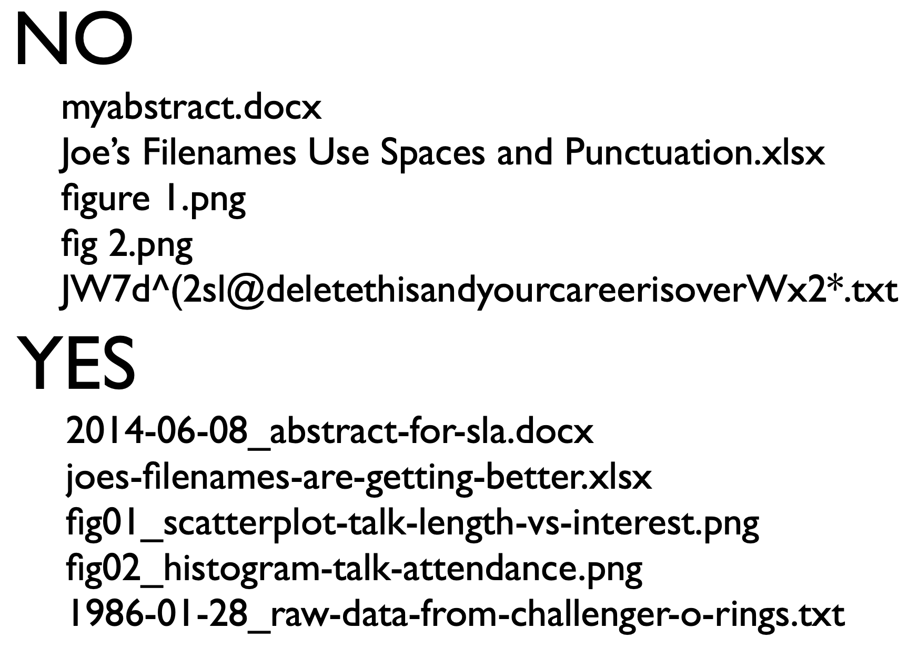
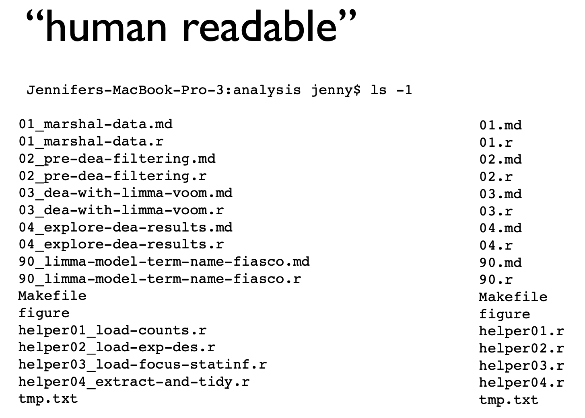
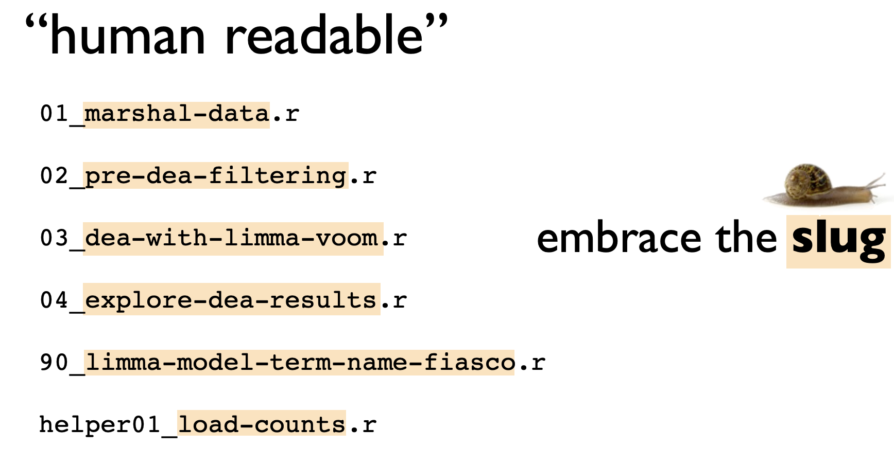
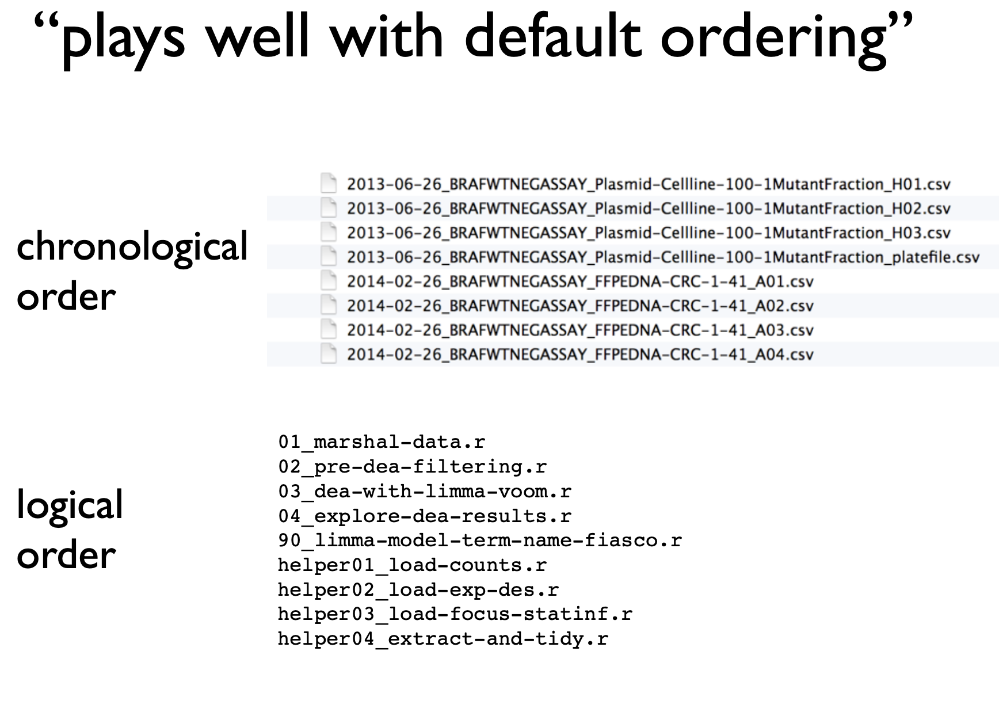
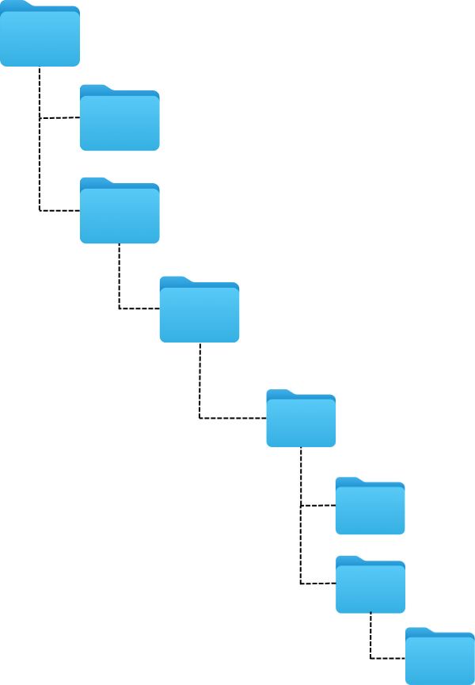
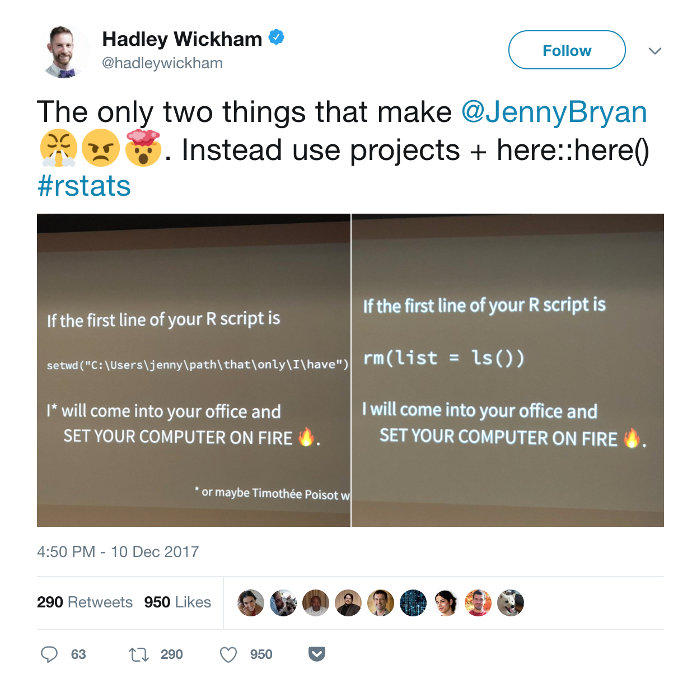
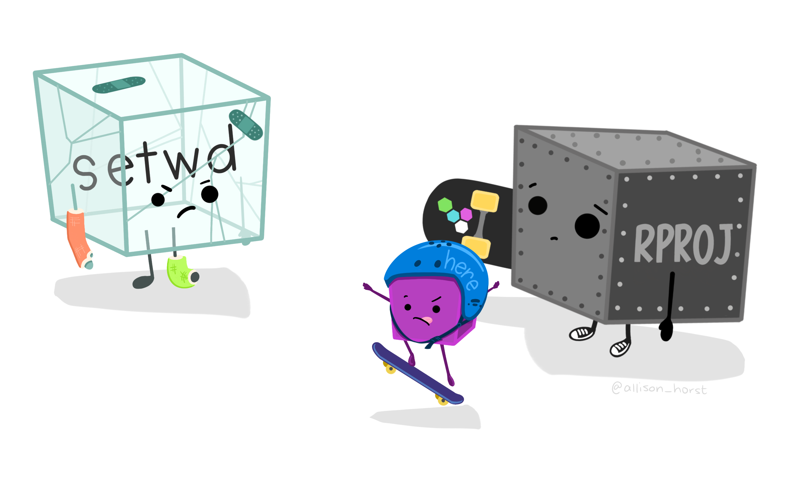

```{r}
library(tidyverse)
```

## Organização local: questão de estilo? 

> Na minha bagunça eu me encontro...

{fig-align="center" width="70%"}

## Modelo mínimo para organização local de um projeto 

::::: columns
::: {.column width="50%"}
](figuras/my-tier-folders-pt.png){fig-align="center" width="80%"}
:::

::: {.column width="50%"}
-   Segue uma *estrutura hierarquica* compreensível

-   Separação de arquivos

-   *Nomes curtos* (sem caracteres especiais) e com *significado*

-   Acomoda *particularidades* para cada projeto

-   **README** é essencial para a descrição
:::
:::::

## Nomeando arquivos 

{fig-align="center" width="70%"}

## Nomeando arquivos - Baseado no trabalho da [Jenny Brian](http://www2.stat.duke.edu/~rcs46/lectures_2015/01-markdown-git/slides/naming-slides/naming-slides.pdf)

::::: columns
::: {.column width="50%"}
{fig-align="center" width="70%"}
:::

::: {.column width="50%"}
-   Lido por máquinas
-   Lido por humanos
-   A ordem que se apresentam faz sentido
:::
:::::

## Nomeando arquivos - Baseado no trabalho da [Jenny Brian](http://www2.stat.duke.edu/~rcs46/lectures_2015/01-markdown-git/slides/naming-slides/naming-slides.pdf)

::::: columns
::: {.column width="50%"}
{fig-align="center" width="70%"}
:::

::: {.column width="50%"}
-   Lido por máquinas
-   **Lido por humanos**
-   A ordem que se apresentam faz sentido
:::
:::::

## Nomeando arquivos - Baseado no trabalho da [Jenny Brian](http://www2.stat.duke.edu/~rcs46/lectures_2015/01-markdown-git/slides/naming-slides/naming-slides.pdf)

::::: columns
::: {.column width="50%"}
{fig-align="center" width="100%"}
:::

::: {.column width="50%"}
-   Lido por máquinas
-   **Lido por humanos**
-   A ordem que se apresentam faz sentido
:::
:::::

## Nomeando arquivos - Baseado no trabalho da [Jenny Brian](http://www2.stat.duke.edu/~rcs46/lectures_2015/01-markdown-git/slides/naming-slides/naming-slides.pdf)

::::: columns
::: {.column width="50%"}
{fig-align="center" width="100%"}
:::

::: {.column width="50%"}
-   Lido por máquinas
-   Lido por humanos
-   **A ordem que se apresentam faz sentido**
:::
:::::

## Ferramentas para organização local: projetos e caminhos 

{fig-align="center" width="40%"}

::: fragment
> Um conjunto de caracteres que mostram um local único no computador/sistema, onde um arquivo ou pasta estão
:::

## Ferramentas para organização local: projetos e caminhos 

> Uma pasta auto contida em seu sistema que agrupa arquivos (por exemplo, dados, scripts, figuras) para realizar uma análise específica

```{r echo=TRUE, eval=FALSE}
getwd()
# [1] "/Users/gabrielnakamura/Library/CloudStorage/OneDrive-Personal/ufmg/pos_ECMVS/Disciplina_Reprodutibilidade_Computacional_Ciencia_Aberta/aulas/organizacao_local_caminhos"
```

## Ferramentas para organização local: projetos e caminhos 

{fig-align="center" width="40%"}

## Ferramentas para organização local: projetos e caminhos 

::::: columns
::: {.column width="50%"}
{fig-align="center" width="60%"}
:::

::: {.column width="50%"}
#### Como representamos esse caminho?
:::
:::::

## Ferramentas para organização local: projetos e caminhos 

{fig-align="center" width="60%"}

## Ferramentas para organização local: `Rproject` + pacote `here` {.center .middle background-image="figuras/Clouds.jpg" background-size="cover"}

{fig-align="center" width="60%"}

## Ferramentas para organização local: `Rproject` + pacote `here` 

{fig-align="center" width="60%"}

## Ferramentas para organização local

### [Prática](https://gabrielnakamura.github.io/USP_reproducibility_BIE5798/Organizacao_dir_local.html#Ferramentas_para_organiza%C3%A7%C3%A3o_do_diret%C3%B3rio_local)

✅ Pacote `{here}`

✅ Usando projetos

✅ Dicas para organização do script
