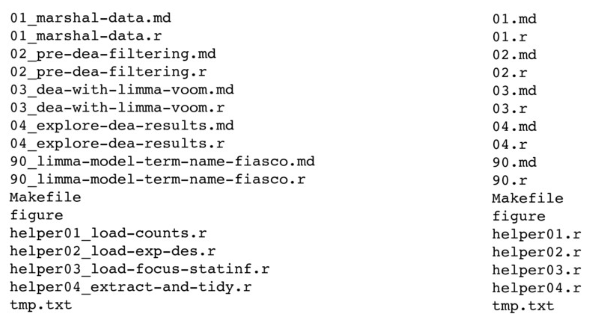

{fig-align="center" width="40%"}

O objetivo dessa seção é proporcionar um brevíssimo compilado de sugestões para nomear arquivos e organizar scripts. Grande parte desse material é baseado no [trabalho da Jenny Bryan](https://speakerdeck.com/jennybc/how-to-name-files)

## Nomeando arquivos

Uma boa regra a ser seguida:

**Human + Machine redable + ordenado**

Em suma, ao nomear arquivos o ideal é que eles sejam possíveis de serem lidos por
    máquinas, humanos e que denotem uma ordem lógica de execução.

Por "serem lidos por máquinas" queremos dizer que se tratam de nomes de arquivos
    estruturados de tal forma que **um computador poderia processar automáticamente**,
    Para tanto, algumas regras são importantes serem seguidas:

- Pense em expressões regulares, por exemplo, vamos supor que temos um conjunto de
    polígonos espaciais que representam a distribuição de diferentes espécies 
    (como, por exemplo, os dados baixados da IUCN). Essa lista de polígonos segue o
    padrão `genero_especie.extencao`. Queremos listar apenas os polígonos das espécies
    do gênero Rhea. Podemos usar algo do tipo:

```{r echo=TRUE,eval=FALSE}
# suponha que seus arquivos estejam na pasta data, que por sua vez está em um projeto

files <- list.files(path = here::here("data"), pattern = "Rhea")

```

- Evite caracteres especiais, espaços, pontuações ou acentuações. Estes caracteres
    dificultam ou até mesmo impedem a leitura automática por máquinas
    
- Use delimitadores para separação de termos nos nomes dos arquivos, por exemplo
   `_` ou `-`

- Use a filosofia "*embrace the slug*", ou seja, os nomes dos arquivos também
   denotam o conteúdo do arquivo
   Exemplo:

```{r echo=FALSE,eval=FALSE}

```  

- Apresentam uma ordem. A imagem anterior também ilustra bem essa lógica. 
   Os arquivos são enumerados de modo a representar uma sequência de uso 
   dos scripts. Isso facilita a compreensão da maneira como o diretório 
   funciona

## Nomeando scripts

Pessoalmente eu utilizo o seguinte esquema

**número_letra-maiúscula_descrição.R**

-   número: usado para indicar a sequência de execução dos scripts

-   letra maiúscula: Código que indica o que o script faz. Uso a seguinte notação

    -   `C` (Clean) leitura e limpeza/processamento de dados
    -   `D` (Do) análises
    -   `S` (Show) gráficos/figuras

-   descrição: uma breve descrição sobre o que o script faz especificamente
    (e.g. glm)

