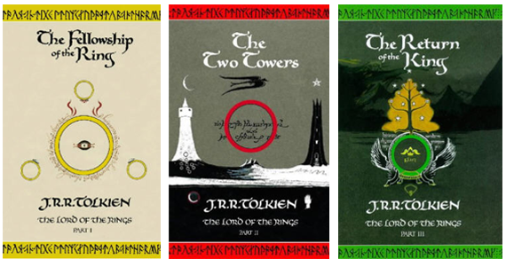

```{r}
library(tidyverse)
```

## Olá! Quem somos {.center .middle background-image="figuras/Clouds.jpg" background-size="cover"}

### Gabriel

{fig-align="center" width="50%"}

## O início {.center .middle background-image="figuras/Clouds.jpg" background-size="cover"}

{fig-align="center" width="80%"}

## Reprodutibilidade {.center .middle background-image="figuras/Clouds.jpg" background-size="cover"}

{fig-align="center" width="70%"}

## Reprodutibilidade: Por que? {.center .middle background-image="figuras/Clouds.jpg" background-size="cover"}

::::: columns
::: {.column width="50%"}
{fig-align="center" width="50%"}
:::

::: {.column width="50%"}
{fig-align="center" width="50%"}
:::
:::::

::: fragment
> **"O artigo científico é o Tinder da Ciência. Não é exatamente mentira, mas somos espertos o suficiente para não casar com alguém só pelo seu perfil aparente"**
:::

# Reprodutibilidade: a importância do processo {.center .middle background-image="figuras/Clouds.jpg" background-size="cover"}

{fig-align="center" width="30%"}

{fig-align="center" width="30%"}

{fig-align="center" width="30%"}

## Reprodutibilidade: a importância do processo {.center .middle background-image="figuras/Clouds.jpg" background-size="cover"}

::::: columns
::: {.column width="50%"}
{fig-align="center" width="100%"}
:::

::: {.column width="50%"}
-   Processo é tão importante quanto o resultado

-   A qualidade do resultado está ligada ao processo

-   Meios justificam os fins (meios são tão importantes quanto o fim)
:::
:::::

## Reprodutibilidade: Por que? {.center .middle background-image="figuras/Clouds.jpg" background-size="cover"}

::::: columns
::: {.column width="50%"}
{fig-align="center" width="100%"}
:::

::: {.column width="50%"}
{fig-align="center" width="70%"}
:::
:::::

## Vivemos uma crise de reprodutibilidade? Sim! Por que? {.center .middle background-image="figuras/Clouds.jpg" background-size="cover"}

{fig-align="center" width="90%"}

## Como resolver? {.center .middle background-image="figuras/Clouds.jpg" background-size="cover"}

> "Reproducibility is like brushing your teeth. Once you learn it, it becomes a habit"

::: fragment
{fig-align="center" width="50%"}
:::

## Como resolver? {.center .middle background-image="figuras/Clouds.jpg" background-size="cover"}

{fig-align="center" width="60%"} \## Como resolver? {.center .middle background-image="figuras/Clouds.jpg" background-size="cover"}

{fig-align="center" width="80%"}

## Como resolver? {.center .middle background-image="figuras/Clouds.jpg" background-size="cover"}

::::: columns
::: {.column width="50%"}
{fig-align="center" width="40%"}
:::

::: {.column width="50%"}
{fig-align="center" width="80%"}
:::
:::::

## Como resolver? {.center .middle background-image="figuras/Clouds.jpg" background-size="cover"}

{fig-align="center" width="80%"}

## Como resolver? {.center .middle background-image="figuras/Clouds.jpg" background-size="cover"}

{fig-align="center" width="80%"}

## Como resolver? {.center .middle background-image="figuras/Clouds.jpg" background-size="cover"}

{fig-align="center" width="80%"}

## Como resolver? {.center .middle background-image="figuras/Clouds.jpg" background-size="cover"}

{fig-align="center" width="80%"}

## Como resolver? {.center .middle background-image="figuras/Clouds.jpg" background-size="cover"}

{fig-align="center" width="80%"}
