# O ABC do versionamento: Clone, Pull, Push and Commits

Vimos nas aulas teóricas que essas palavrinhas não são nada mais que ações que praticamos no nosso dia-a-dia. Agora é hora de colocar em prática.

Já temos um repositório remoto, agora precisamos que ele exista em nossos computadores para que possamos sincronizar nosso trabalho local e remoto. De maneira geral o que queremos fazer a partir de agora está ilustrado na figura seguinte

```{r echo=FALSE,eval=TRUE,out.width="55%"}
knitr::include_graphics("figuras/version-control-all.png")
```

A partir de agora iremos, passo a passo, realizar todas as funções básicas essenciais para organização computacional de um projeto científico.

O primeiro passo é realizar uma clonagem!

## O Clone

```{r echo=FALSE,eval=TRUE,fig.cap="Referência de velho",out.width="55%"}

```

Para que nosso repositório local esteja ligado ao nosso repositório remoto precisamos primeiro conectá-los. Fazemos isso ao clonar o repositório remoto em nossa máquina. Clonar (clone) nesse caso não é nada mais que criar uma cópia exata de um repositório remoto em sua máquina. A partir desse momento esses repositórios estarão conectados até que o Git os separe.

Para clonar vá até o repositório remoto de interesse, e copie a chave https, como mostrado na figura a seguir:

```{r echo=FALSE,eval=TRUE}
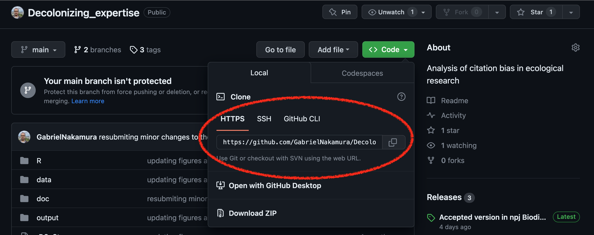
```

Clique no botão de cópia e vamos para o RStudio. No RStudio vá em `File` e depois `New Project`. A partir daí siga as imagens abaixo:

### 1. Copiando a chave https no GitHub

```{r echo=FALSE,eval=TRUE,fig.cap="Copiando chave https"}

```

### 2. Criando um novo **projeto** localmente

```{r echo=FALSE,eval=TRUE,fig.cap="Abrindo um novo projeto"}
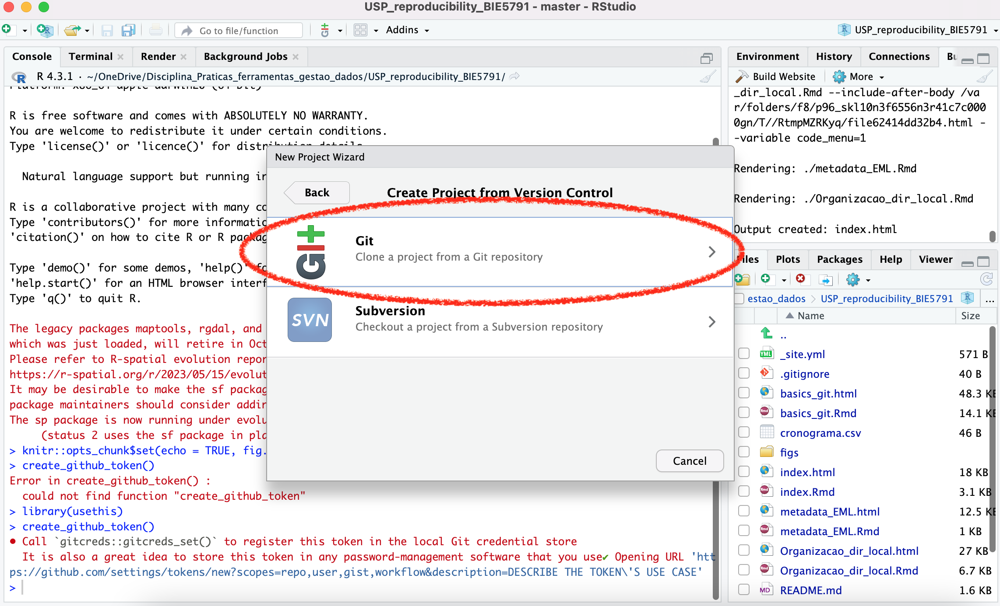
```

### 3. Colando a chave para ligar o repositório remoto com o local

```{r echo=FALSE,eval=TRUE,fig.cap="Colando a chave https"}
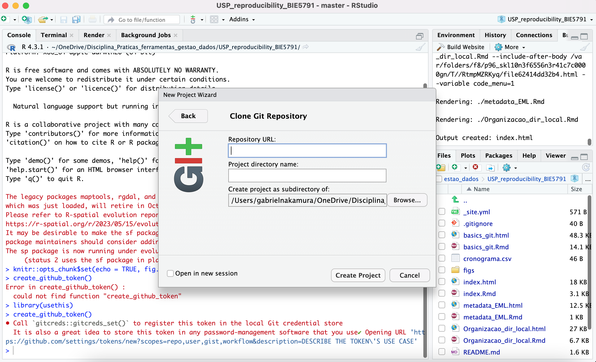
```

Ao clicar em `Create project` o repositório remoto será imediatamente transferido para o seu computador. Uma pasta (o diretório local) será criado no local que você escolheu e, assim, RStudio, Git e Github estarão plenamente conectados. Tudo certo até aqui? Uma pausa para descanso com um vídeo.

```{r echo=FALSE,eval=TRUE}
vembedr::embed_url("https://www.youtube.com/watch?v=j7K3s_vi_1Y")
```

## Pull, Commits e Push

Se você chegou até aqui sem erros isso quer dizer que Git e GitHub já estão integrados no RStudio. Portanto, qualquer coisa que fizermos nesta pasta está sendo observado a partir de agora pelo git. Para certirficar-se disso, habilite a visualização de arquivos ocultos no seu computador, você vai notar que na raiz desta pasta clonada existe uma pasta `.git`, como na figura a seguir

```{r echo=FALSE,eval=TRUE}
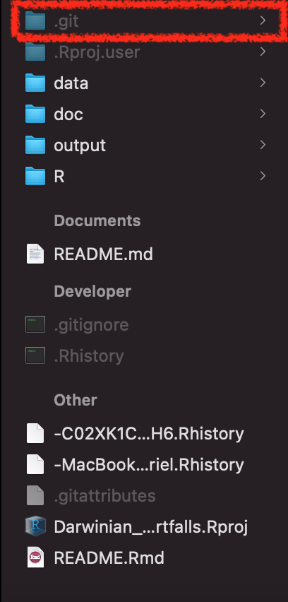
```

Se você consegue ver esta pasta quer dizer que está tudo certo, e o git está observando (**watch** no jargão do versionamento) cada modificação e cada arquivo dentro desta pasta (a menos que você inclua o arquivo no .gitignore, mas isso é assunto para outro momento).

```{r echo=FALSE,eval=TRUE,out.width="55%"}

```

Agora iremos executar funções que, até o fim deste curso, serão quase automáticas no nosso fluxo de trabalho com versionamento.

### Meu primeiro commit

O que é um commit?

Commit, ou "revisão", é uma mudança individual em um arquivo ou um conjunto de arquivos dentro da pasta observada pelo git. Os commits são como check-points para o nosso repositório. Uma analogia interessante para os commits foi apresentada na aula e está ilustrada aqui, na figura seguinte

```{r echo=FALSE, eval=FALSE,out.width="60%"}
knitr::include_graphics(here::here("figuras", "commit-only-concept.png"))
```

Vamos pensar que nosso projeto é uma montanha, e estamos escalando ele. Nosso objetivo final é, obviamente, finalizar o projeto, chegando ao topo da montanha. A medida que progredimos,caso venhamos a cometer um erro, a queda pode ser grande. Desta maneira, utilizamos grampos onde ancoramos nossa corda a medida que a escalada progride. Em caso de erro, a queda será apenas até o grampo anterior onde a corda foi ancorada. Os commits servem como os clipes que ancoram a corda a medida que progredimos no projeto. Se cometermos um erro em algum arquivo, tudo certo, podemos voltar no commit anterior, ou anteriores, para tentar descobrir onde o erro foi cometido.

Da mesma forma que na escalada, se utilizarmos clipes muito pertinhos uns dos outros vamos ficar lentos demais, e o progresso até o topo será comprometido, se fizermos muitos commits será difícil voltar em momentos específicos do projeto, visto que terão muitos commits para serem checados. Portanto, a regra é: faça commits com parcimonia, ou seja, nem muitos, nem poucos.

Apesar do conteúdo do commit variar muito existem algumas sugestões de boas práticas
    que podem ser seguidas para escrever o commit. Uma sugestão retirada do site 
    do [Lucas Caton](https://www.lucascaton.com/pt-BR/2017/10/16/como-escrever-mensagens-de-commits-no-git) e que pode ajudar na hora de escrever seus commits é sempre pensar
    em completar essa frase para seu commit:
    
  > Se aplicado, esse commit irá `sua mensagem de commit aqui`
  
Note que, mais importante que "como" é "o que foi feito".

#### Praticando

Vamos fazer uma modificação na nossa pasta. Podemos adicionar arquivos, já que ela está
    vazia. Para aqueles que não tem dados ainda, podem utilizar os arquivos do pacote
    de dados palmer penguins que estão nesse repositório. Lembre-se de ler os arquivos
    utilizando o `{here}` e utilizar o Rproject para abrir o diretório.

```{r echo=TRUE,eval=FALSE}
data_penguins <- read.csv(here::here("data", "data-penguins.csv")) 
```

::: {.callout-note}
## Trabalhe com seus próprios dados

Se quiserem usar seus próprios dados fiquem a vontade, o uso do palmerpenguins 
    é apenas opcional e a título de procedimento didático. Caso estejam trabalhando
    com seus próprios dados, jogue os arquivos para dentro do diretório que clonamos.
    O próximo passo é fazer nosso primeiro commit.
:::

### Explorando commits

```{r echo=FALSE, eval=TRUE,out.width="70%"}
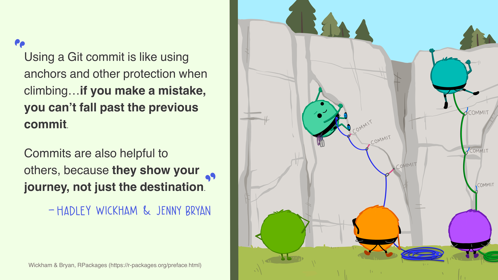
```

Existem duas formas de fazer versionamento usando o Git e Github via RStudio. Uma delas é a linha de comando, a outra é via uma interface visual, que nesse caso é o próprio RStudio. Vamos começar fazendo o versionamento via interface visual. A opção para isso é que ninguém se assuste num primeiro momento com a linha de comando, e que isso não seja um impeditivo para utilizar o versionamento no seu fluxo de trabalho. A maioria dos comandos básicos podem ser executados através desta interface gráfica que chamamos de **Git Client**

Repare que seu RStudio agora tem algumas coisas novas. Especificamente, veja que agora ele tem uma aba chamada Git, como ilustrado na figura abaixo

```{r echo=FALSE,eval=TRUE}
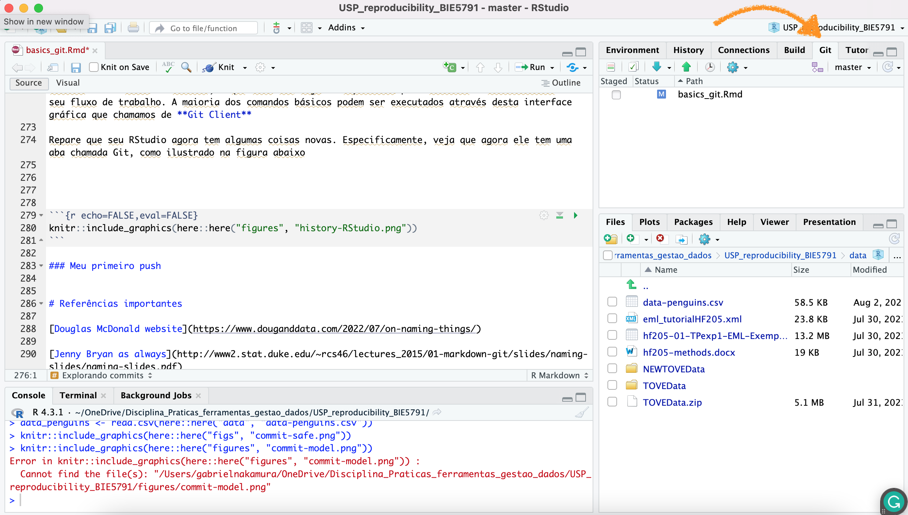
```

Isso indica que o git está funcionando no seu diretório, e agora podemos fazer o versionamento deste diretório local e sincronizá-lo com o repositório remoto.

Tudo e qualquer coisa que for adicionado ou modificado na sua pasta vai aparecer na janela abaixo da aba git. Como mostrado na figura abaixo

```{r echo=FALSE,eval=TRUE}
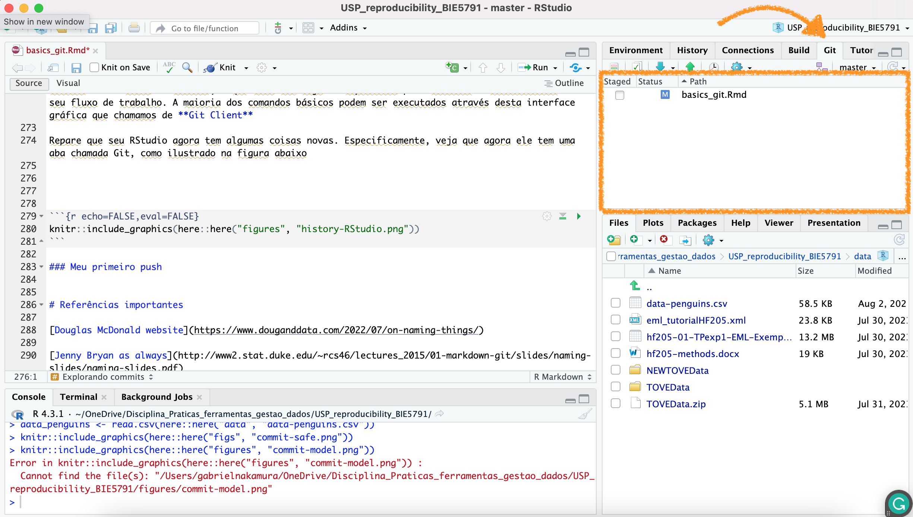
```

Como eu mencionei na aula teórica e aqui acima, o commit é como um track changes do word, mas melhor. Precisamos fazer um track change manual, indicando o que foi modificado, isso é o nosso commit. Para realizar um commit via a interface do RStudio você precisa:

1 - Clicar no botão `commit pending changes` (ou em qualquer botão naquela aba), como mostrado abaixo

```{r echo=FALSE,eval=TRUE}
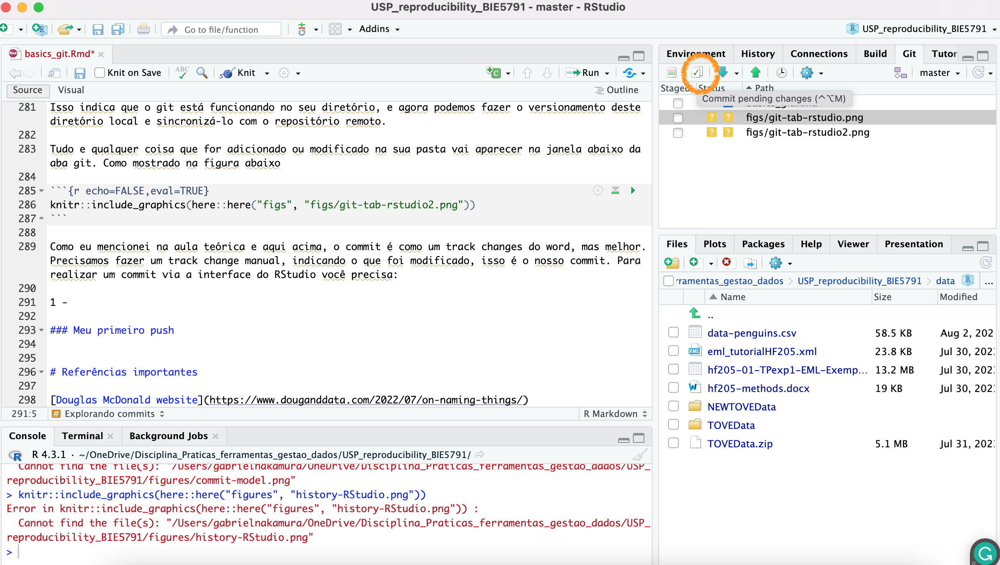
```

2 - Isso vai abrir uma nova janela, nela você deve selecionar nos checkbox os arquivos (vamos dar uma olhada nessa janela antes de prosseguir)

```{r echo=FALSE,eval=TRUE}
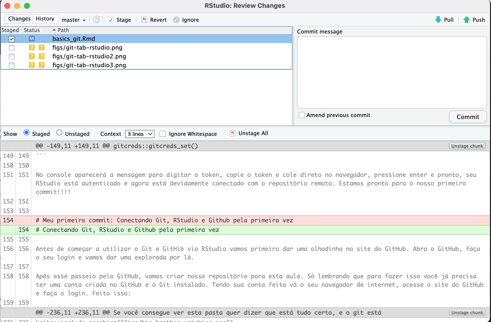
```

3 - Escreva uma mensagem informativa. Como este é o primeiro commit geralmente selecionamos todos os arquivos e escrevemos a mensagem `First commit` para indicar que é o primeiro commit deste repositório

```{r echo=FALSE,eval=TRUE}
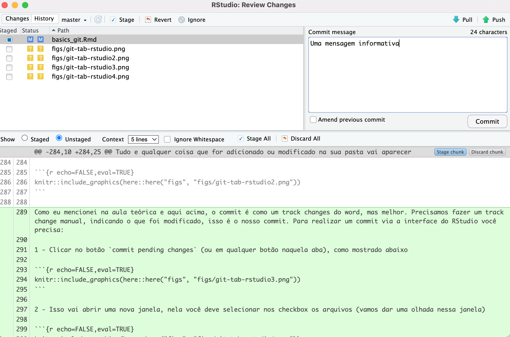
```

**OBS** A mensagem deve ser realmente informativa, o commit fica armazenado no seu repositório e aparecerá publicamente caso o repositório seja público.

```{r echo=FALSE,eval=TRUE,out.width="60%"}
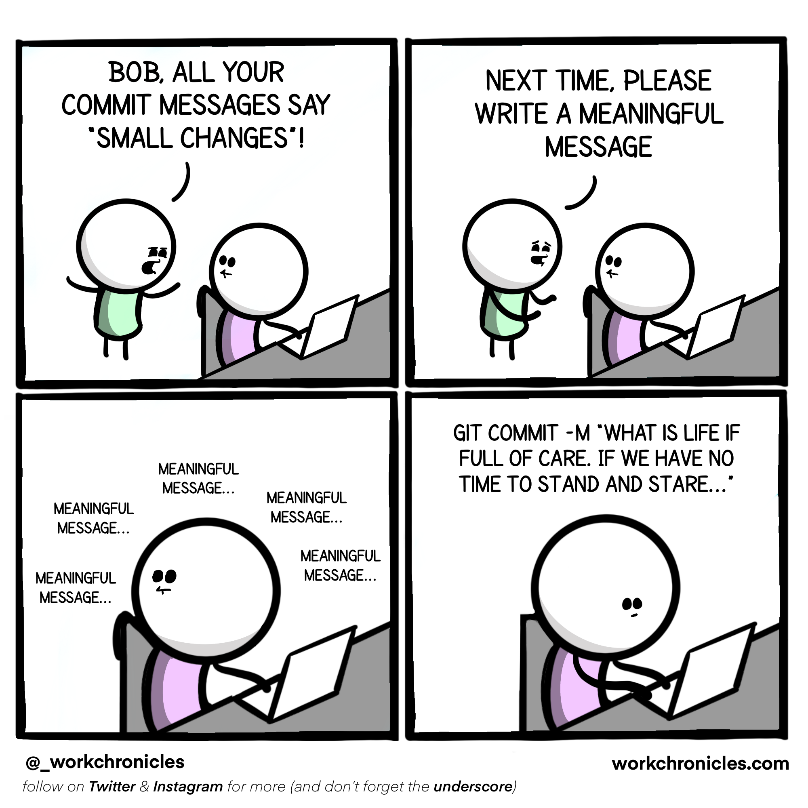
```

Pronto, o que fizemos agora foi basicamente colocar nossos arquivos na **stagging area** (marcar as checking box) e prepará-los para a entrega com uma mensagem informativa, o commit. Agora precisamos enviar os arquivos para o repositório remoto (upstream)

### Meu primeiro push

Temos um diretório functionando com o git, ligado ao github, com documentos dentro, mas, até agora ele apenas vive em nossos computadores. Chegou a hora de empurrar estes documentos para o diretório remoto, ou seja, aquele que clonamos lá no início. Para tanto vamos fazer um `push`

O push nada mais é que empurrar os documentos para o repositório do github, chamado as vezes de `origin/master` e outras vezes `origin/main`, mas ambos querem dizer "um repositório remoto o qual o diretório que estou trabalhando está ligado".

Sem mais delongas, para fazer um push precisamos apenas apertar o botão verde como mostrado na figura abaixo

```{r echo=FALSE,eval=TRUE}
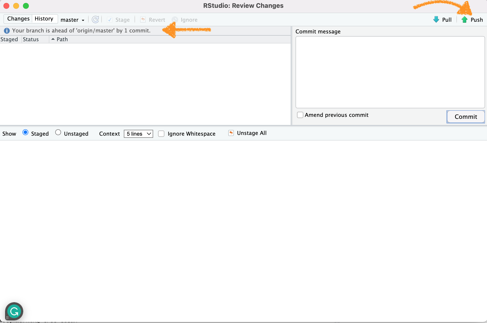
```

Duas coisas são importantes notar nesse momento. Primeiro o botão de push, que vai empurrar os arquivos para o repositório remoto (origin). Segundo, a mensagem destacada com a seta. Ela diz que o *branch* está a frente do *origin/master* por um *commit*. Traduzindo, nosso diretório local (branch), está uma versão a frente (pois modificamos coisas aqui) em relação ao nosso repositório remoto (origin/master). Ao empurrar (push) as modificações, essa mensagem desaparecerá, indicando que tanto branch quanto origin estão na mesma linha do tempo!

# Extras

Aqui algumas dicas extras caso você queira seguir caminhos diferentes que os apresentados até agora para montar um repositório e conectar com o github. Vamos supor que você já tenha um projeto local em seu computador que já está monitorado pelo git, contém alguns commits, e você não quer perder estes commit. A forma mais fácil de fazer isso é através do pacote `{usethis}`. Para utilizar esta abordagem você precisa ter o PAT (Personal Access Token que criamos lá em cima).

1 - verifique se o git está funcionando em seu repositório (veja se aparece a tab git no seu RStudio). Caso não veja você precisa iniciar o git no diretório que está trabalhando. Para fazer isso:

```{r echo=TRUE,eval=FALSE}
usethis::use_git()
```

Outras opções existem, por exemplo, usando o terminal diretamente. Mas vamos manter a consistência e utilizar sempre o pacote usethis quando possível.

2 - uma vez que o git está funcionando neste repositório, precisamos criar um repositório remoto para ele no nosso perfil do GitHub. Para tanto precisamos apenas digitar:

```{r echo=TRUE,eval=FALSE}
usethis::use_github()
```

# Atividade

Hora de praticar com seus dados, ou ainda com os dados do palmerpenguins. Faça algumas modificações na tabela, salve um novo objeto, faça um commit e um push. Após fazer isso verifique na página do repositório no GitHub o que aconteceu.

# Referências importantes

[Douglas McDonald website](https://www.douganddata.com/2022/07/on-naming-things/)

[Jenny Bryan](http://www2.stat.duke.edu/~rcs46/lectures_2015/01-markdown-git/slides/naming-slides/naming-slides.pdf)

[Hadley Wickham](http://adv-r.had.co.nz/Style.html)

[Oh Shit, Git!?!](https://ohshitgit.com/)

# Slides

Aqui você encontra os slides apresentados em aula sobre esse tópico

[Tela cheia 📺](slides.qmd)

```{=html}
<iframe class="slide-deck" src="slides.html" height="420" width="750" style="border: 1px solid #2e3846;"></iframe>
```
