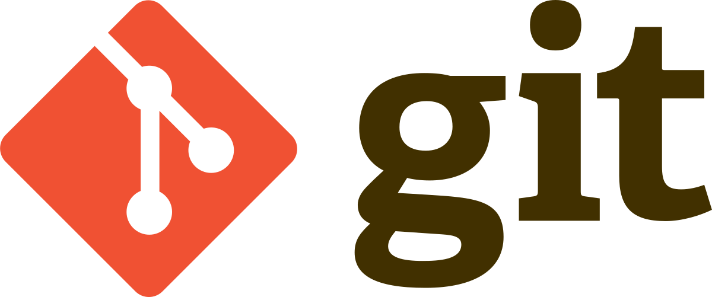
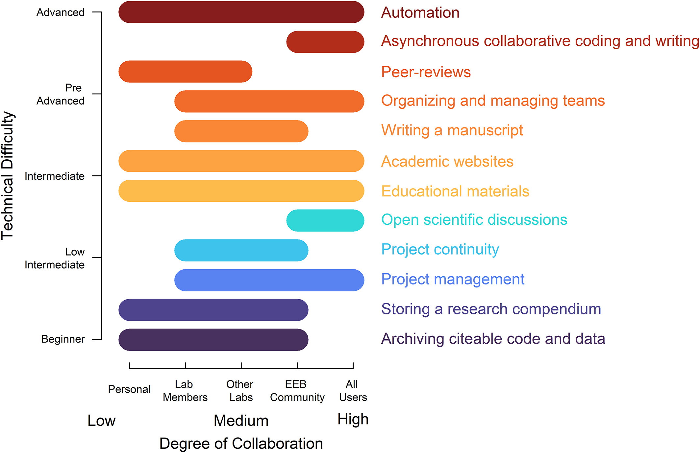
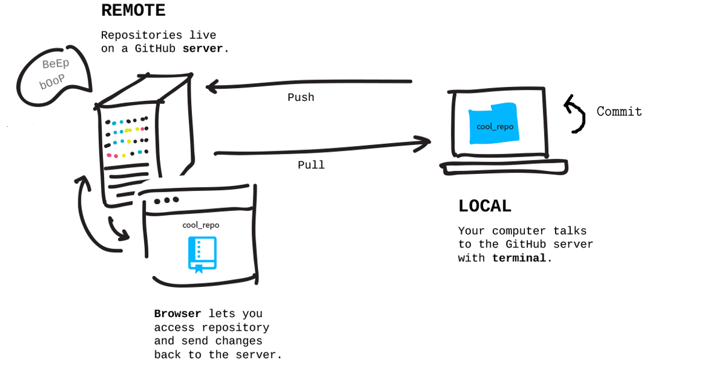
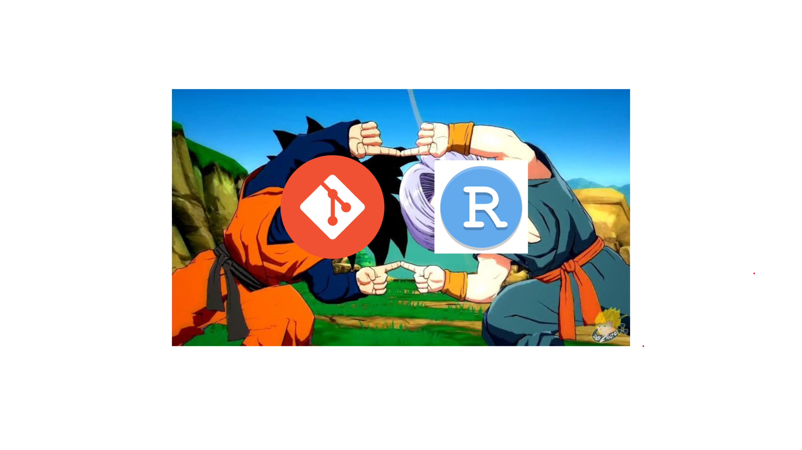
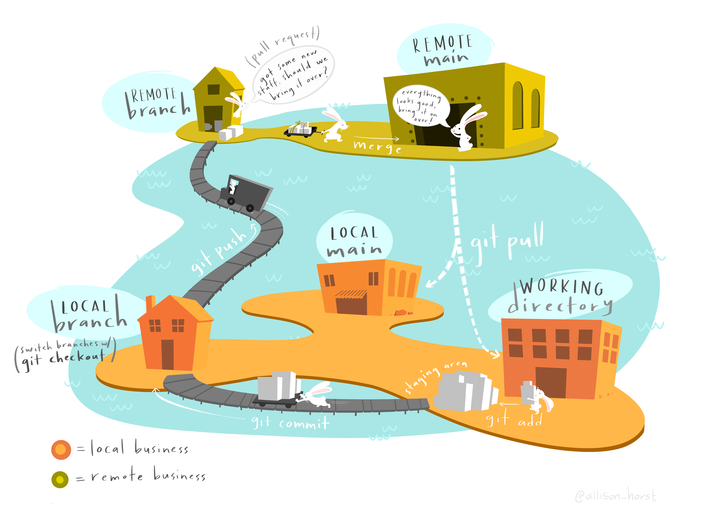
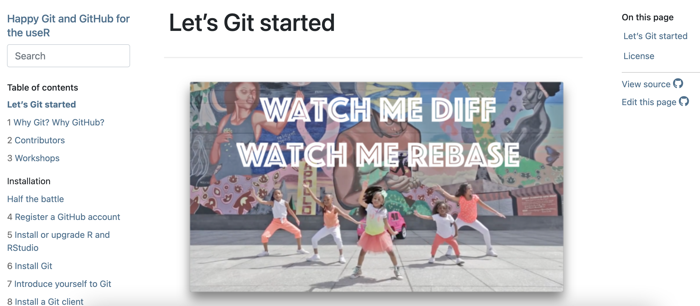

## Controle de versão e repositório remoto: Git, GitHub e RStudio 

{fig-align="center" width="70%"}

## Controle de versão e repositório remoto: Git, GitHub e RStudio 

### O que é Git, GitHub e quais diferenças?

## Controle de versão e repositório remoto: Git, GitHub e RStudio 

::::: columns
::: {.column width="50%"}
{fig-align="center" width="80%"}

:::
::: {.column width="50%"}
{fig-align="center" width="80%"}

:::
:::::

## Controle de versão e repositório remoto: Git, GitHub e RStudio 

### Git

## Controle de versão e repositório remoto: Git

::::: columns
::: {.column width="50%"}
{fig-align="center" width="70%"}
{fig-align="center" width="50%"}
:::
::: {.column width="50%"}

- Concebido para grandes projetos colaborativos (Linux)

- Executa todo o controle de versões

- Funciona independente de um repositório remoto 
:::
:::::

## Controle de versão e repositório remoto: Git, GitHub e RStudio 

### Github

## Controle de versão e repositório remoto: GitHub

::::: columns
::: {.column width="50%"}
{fig-align="center" width="80%"}
:::
::: {.column width="50%"}

- Repositório remoto (a nuvem)

- Outros tipos de repositório (ex. Gitlab)

- Inúmeras funcionalidades (Vizualização, armazenamento, colaboração etc.)
:::
:::::

## Controle de versão e repositório remoto: Git, GitHub e RStudio 

### Diferenças e usos do Git e GitHub?

## Controle de versão e repositório remoto: Git e GitHub 

::::: columns
::: {.column width="50%"}

{fig-align="center" width="100%"}
:::
::: {.column width="50%"}
- Inúmeras funcionalidades (Vizualização, armazenamento, colaboração etc.)

{fig-align="center" width="80%"}
:::
:::::

## Controle de versão e repositório remoto: Git, GitHub e RStudio 

### E o RStudio?

## Controle de versão e repositório remoto: RStudio 

{fig-align="center" width="80%"}

## Controle de versão e repositório remoto: Git, GitHub e RStudio 

::::: columns
::: {.column width="50%"}
{fig-align="center" width="80%"}
:::
::: {.column width="50%"}

- Funciona como um ambiente de desenvolvimento integrado
    + faz o track-changes
    + faz os commits
    + faz os pull e push
    + faz TUDO em um só lugar

:::
:::::

## Controle de versão e repositório remoto: resumindo

{fig-align="center" width="80%"}

## Controle de versão: [em caso de dúvidas](https://happygitwithr.com/)

{fig-align="center" width="70%"}

## Controle de versão: em caso de dúvidas

{fig-align="center" width="80%"}

## [Prática](https://gabrielnakamura.github.io/USP_reproducibility_BIE5798/basics_git.html)

✅ Integrando Git, GitHub e RStudio

✅ Comandos básicos - clone, pull, push e commit 

✅ Navegando entre versões

✅  Trabalho colaborativo - pull request, branchs
