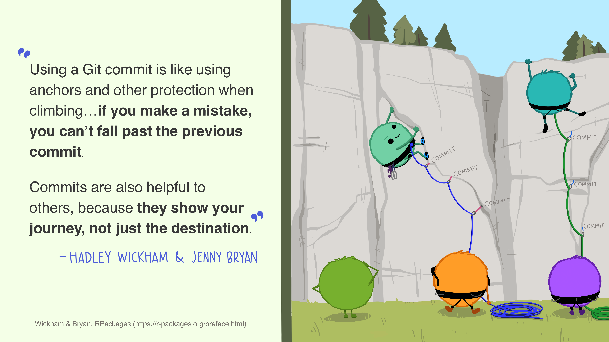
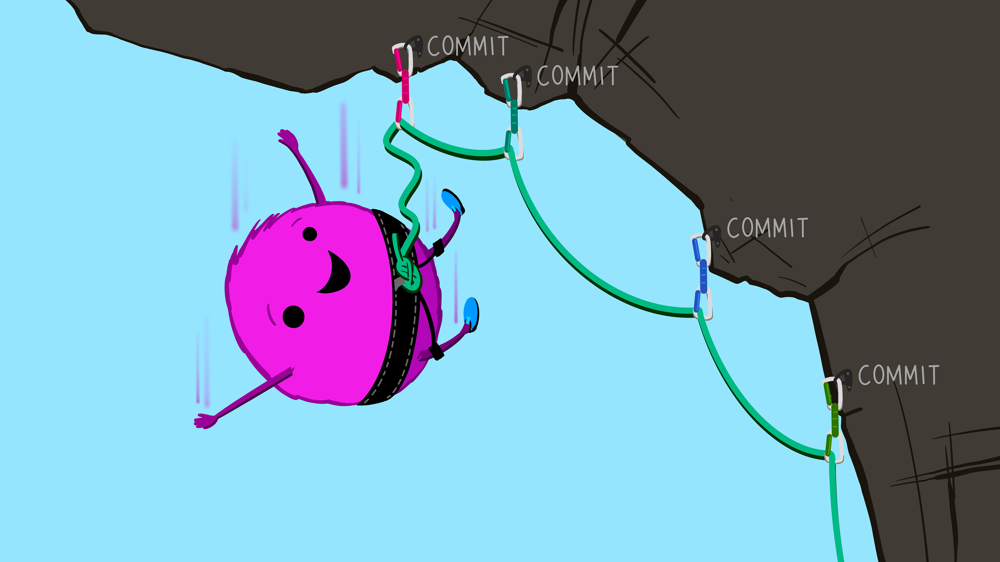
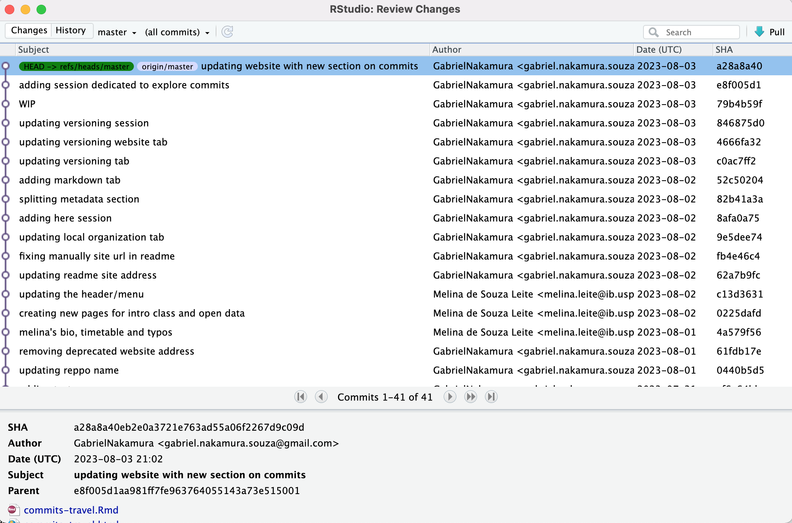
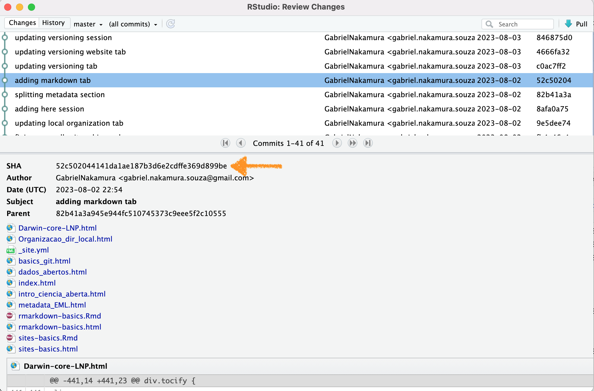
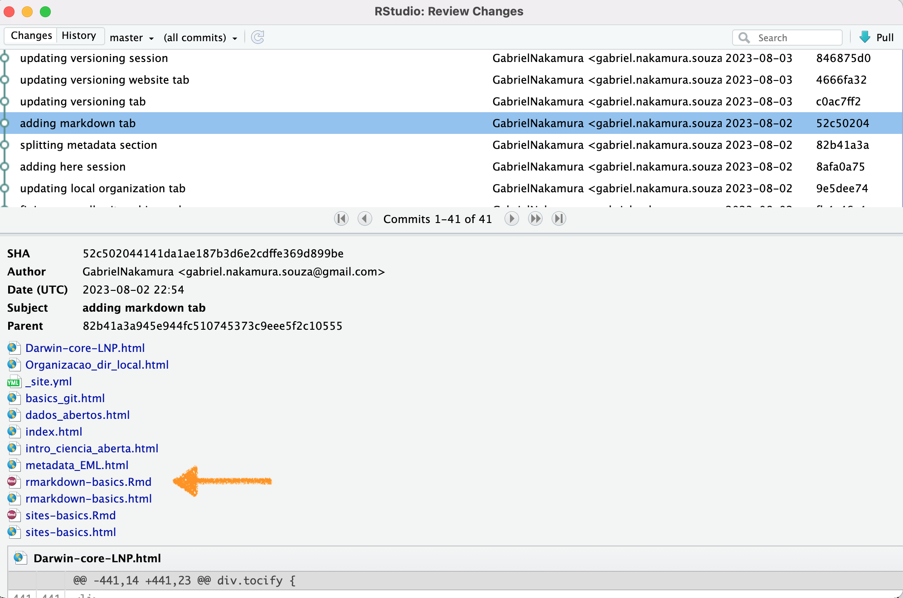

# Apresentação

Nesta seção iremos explorar um pouco mais o poder que os commits nos oferecem,
    incluindo boas práticas para fazer commits nos nossos arquivos e como "viajar"
    entre commits passados. Este momento também servirá para ficarmos um pouco mais
    familiarizados com o uso do Git através do terminal. Vamos utilizar o teminal
    visto que algumas coisas que faremos aqui não podem ser feitas através do RStudio.

Sempre ao fazer commits vale lembrar dessas palavras:

```{r echo=FALSE, eval=TRUE,out.width="70%"}

```

Os commits podem ser pensados como sendo fotografias tiradas do seu repositório
   em diferentes momentos do tempo. Essas fotografias contém não só o estado 
   do seu repositório naquele momento, mas também uma série de informações
   adicionais como o autor do commit, o dia e a hora que ele foi realizado, entre
   outros. Os commits são uma ferramenta poderosa para que possamos navegar
   no processo de estruturação do nosso repositório e do nosso projeto ao longo
   do tempo

Outra forma de entender a utilidade dos commits é através de pontos de segurança
    do desenvolvimento do seu projeto, de modo que, se algo que não é desejado
    acontece os commits podem funcionar como pontos de ancoragem do seu trabalho, 
    de modo que você sempre pode voltar para algum ponto de maneira segura.
    
```{r echo=FALSE, eval=TRUE,out.width="70%",fig.cap="Commits podem ser entendidos como costuras em uma escalada"}

```

# Workflow para os commits 

Em primeiro lugar sempre cheque se está tudo certo com seu repositório, se seu 
    trabalho local está sincronizado com seu trabalho remoto. Para tanto pode 
    digitar na linha de comando do terminal

```{r echo=T,eval=FALSE}
git status
```

Se sua *working tree* estiver no status *clean*, quer dizer que você está 
    sincronizada com o *origin*

Faça algumas modificações e depois vamos fazer a mesma sequencia de ações que fizemos anteriormente (stage, commit, push), mas agora usando a linha de comando. Para tanto podemos fazer assim

```{r echo=TRUE,eval=FALSE}
git add .
git commit -m "uma mensagem informativa"
git push
```

Pronto, fizemos a mesma coisa que anteriormente em aulas passadas, mas agora 
    utilizando o terminal :)

## Amend

Lembra que muitos commits podem te deixar muito lento na escalada? E poucos 
    commits podem ser pouco informativos caso queira reconstruir o que aconteceu 
    com o repositório? Pois então, existe uma estratégia interessante para realizar 
    commits, chamada de `amend`

Em um amend nós basicamente adicionamos um commit a um outro já existente. 
    Por exemplo, imagine que fez apenas algumas poucas modificações de código que 
    não necessitam necessariamente de um commit dedicada exclusivamente para tais, 
    você pode fazer o seguinte:

1 - stage o arquivo que modificou

```{r echo=TRUE,eval=FALSE}
git add path/to/file
```

2 - faça um commit 

```{r echo=TRUE,eval=FALSE}
git commit -m "WIP"
```

Note que coloquei **WIP** neste commit, por que? WIP é uma sigla usada comumente no
    versionamento para Working In Progress. Sempre que tiver um commit desse quer
    dizer que o commit que fez ainda está sendo trabalhado.

Ainda não faça o push. Faça mais algumas modificações, e, digamos que agora fez modificações relevantes no código que merecem um commit dedicado. Mas lembre-se que o último commit é um WIP. O que fazemos agora é um amend ao WIP

3 - faça um amend

```{r echo=TRUE,eval=FALSE}
git commit --amend -m "Aqui um commit com uma mensagem informativa, como sempre"
git push
```

Pronto, agora temos uma mensagem informativa que foi adicionada ao WIP e não precisamos fazer um push do passo intermediário (WIP), deixando nossa escalada mais rápida

## Viajando entre commits

Uma das maiores potencialidades dos commits é a possibilidade que podemos navegar entre commits. Ou seja, podemos navegar entre estados distintos do nosso trabalho a medida que ele é desenvolvido. Podemos checar esse histórico tanto na nossa página do repositório no GitHub quanto usando o RStudio, como mostrado na imagem a seguir

```{r echo=FALSE, eval=TRUE,out.width="70%"}

```

Para tanto você precisa apenas abrir a aba do Git no RStudio, como vimos anteriormente, e clicar em **History** no canto superior esquerdo da janela de revisões. Tudo o que vemos são todos os commits que foram realizados desde que esse repositório foi formado pela primeira vez.

## Elementos importantes do commit

Alguns elementos presentes no commit são importantes. O principal deles é a chave SHA-1. Esta se trata de um identificador único do commit. Com ela podemos viajar entre commits, ou referenciar um dado commit em uma discussão no github. Por exemplo, supondo que estamos trabalhando colaborativamente (como nesse site :)), e eu gostei particularmente mais da versão do site que está há alguns commits atrás. Uma opção é abrir uma Issue (veremos isso mais tarde), e referenciar esse número. Ou simplesmente dizer para meu colaborador "Ei! dê uma olhada no commit número XXXXXX". Na imagem abaixo está em destaque a chave SHA.

```{r echo=FALSE, eval=TRUE,out.width="70%"}

```

Você pode abrir o arquivo no estado em que ele se encontrava em um dado commit clicando no arquivo modificado naquele commit selecionado. Por exemplo, digamos que eu queira ver o arquivo chamado `rmarkdown-basics` deste site editado dia 02 de Agosto, só precisamos clicar no arquivo, como mostrado na imagem abaixo:

```{r echo=FALSE, eval=TRUE,out.width="70%"}

```

## Atividade

Explore um pouco os commits que realizaram. Abra a página do github e também através do Rstudio, veja as diferenças, as vantangens e desvantagens de cada uma das abordagens


## Throwback Commit

Vamos supor que realizamos um commit errado, e agora queremos voltar ao commit anterior, mas sem perder o trabalho que fizemos nos arquivos. Para isso podemos usar a abordagem anterior, navegando entre os arquivos e selecionando o arquivo que queremos em um determinado estado, substituimos pelo arquivo atual e fazemos um novo commit. Esta opção pode ser a mais segura se estamos começando a mexer no versionamento. Outra opção é explorar as funções do git chamadas `reset`. As funções reset basicamente move o HEAD do seu diretório para um commit no passado. Esta abordagem pode causar algumas dores de cabeça no início, portanto recomendo usa-lá com cautela. Para mais informações sobre isso dê uma olhada [nesse site](https://devconnected.com/how-to-git-reset-to-head/#:~:text=To%20hard%20reset%20files%20to,option%20and%20specify%20the%20HEAD.&text=The%20purpose%20of%20the%20%E2%80%9Cgit,before%20HEAD%20and%20so%20on).)


# Inutilidades públicas necessárias

No fim do dia, aprendemos fazer commits apenas para utilizar essa ferramenta [aqui](https://starlogs.dev/). Cole o link de seu repositório contendo alguns commits e veja o que acontece


# Slides

Aqui você encontra os slides apresentados em aula sobre esse tópico

[Tela cheia 📺](slides.qmd)

```{=html}
<iframe class="slide-deck" src="slides.html" height="420" width="750" style="border: 1px solid #2e3846;"></iframe>
```
