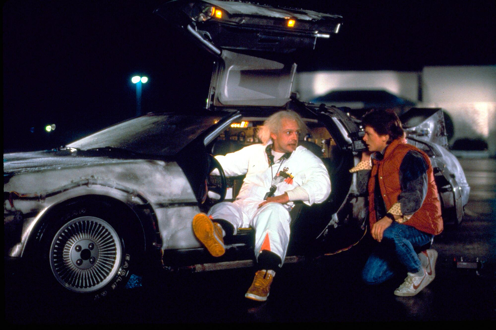
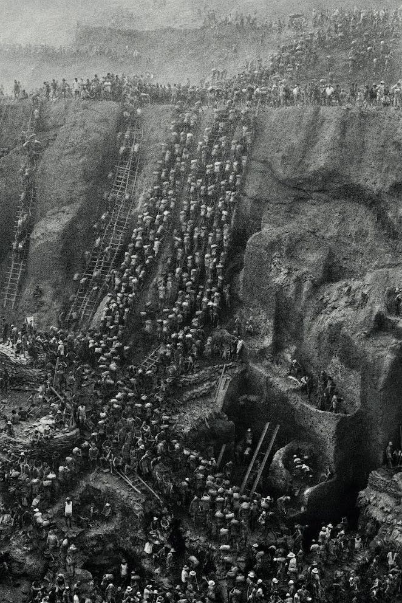
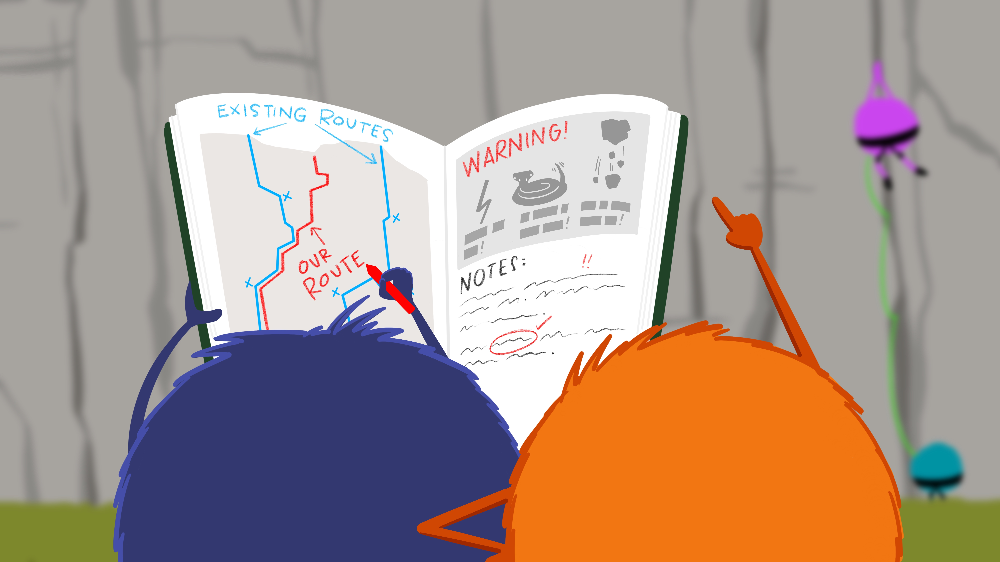

## Viajando no tempo

{fig-align="center" width="70%"}

## Viajando no tempo

{fig-align="center" width="40%"}

## Viajando no tempo: commits

> Commits são como fotografias com anotações em seu verso. Eles nos
    ajudam a lembrar o estado do seu trabalho naquele exato momento 
    registrado

## Commits: navegando com segurança

{fig-align="center" width="80%"}

## Commits: protegendo contra si

{fig-align="center" width="80%"}

## Commits: ilustrando o trajeto para outros

{fig-align="center" width="80%"}

## Commits na prática: visualizando os commits

