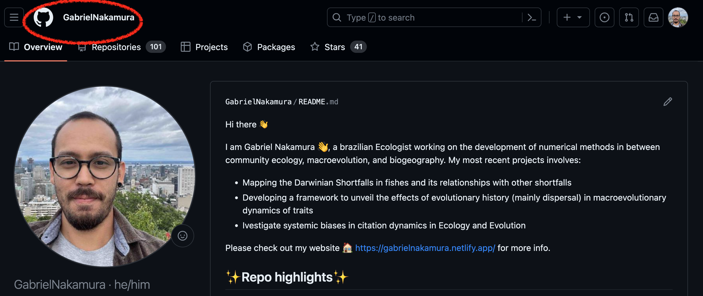
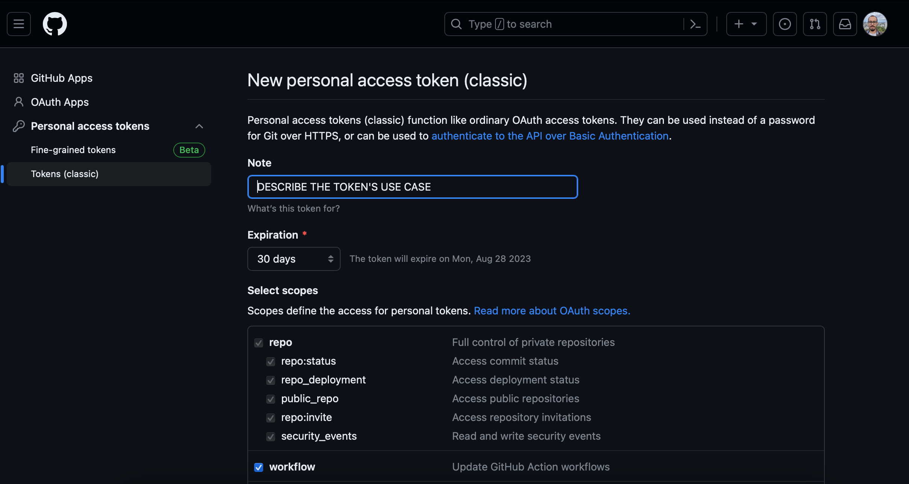
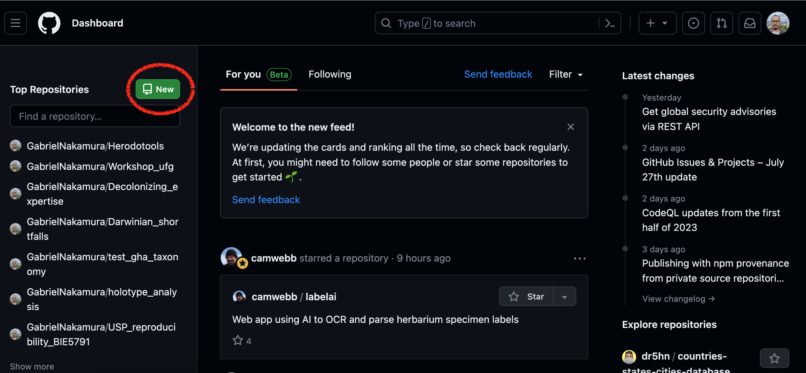

# Apresentação

Nesta primeira seção irei apresentar as principais ferramentas que utilizaremos para nos ajudar na organização de dados, scripts, análises e projetos científicos em geral. Estas ferramentas irão auxiliar desde a organização local de seus dados até a disponibilização destes dados em plataformas de acesso aberto. Várias delas já devem ser velhas conhecidas por vocês, por exemplo, o RStudio, então dispensam maiores apresentações. Por isso, grande parte deste documento vai tratar de uma ferramenta até bem conhecida pelo nome, mas que pra muita gente pode parecer coisa de outro mundo: o **Git**. Vocês verão que algumas das funções que ele possibilita realizar nós já fazemos no dia-a-dia através de outros aplicativos, porém, com mais eficiência e controle das ações.

Grande parte das práticas que realizaremos serão voltadas para códigos e pacotes em **linguagem R**, porém vale destacar que o versionamento utilizando o Git pode ser feito em projetos que utilizem qualquer outra linguagem de programação a restrição para o R é uma escolha decorrente da maior familiaridade desta linguagem por parte dos elaboradores desta disciplina e também por se tratar da linguagem mais comum utilizada em Ecologia e Evolução para programação e análise de dados.

## Pacotes necessários

Para executar os códigos desta seção é importante ter os seguintes pacotes instalados: `usethis`, `devtools` e `gitcreds`

Você pode realizar a instalação utilizando a seguinte linha de código:

```{r librariesRead, echo=TRUE, eval=TRUE}
libs <- c("usethis", "devtoos", "gitcreds")
if (!requireNamespace(libs, quietly = TRUE)){
    install.packages(libs)
  }
```

Caso você não tenha os pacotes acima citados a instalação será realizada. Caso já tenha em seu computador, nada irá acontecer.

# Hello Git - Introdução ao uso de sistema de controle de versão

O Git trata-se de um sistema de controle de versões, mas afinal, o que é um sistema de controle de versões? Estamos mais acostumados do que imaginamos quando o assunto é controle de versões, apesar de parecer algo de outro mundo. Um exemplo que todos nós estamos acostumados é oferecido pelo editor de texto Word, quando ligamos a opção "Track changes". Ao fazermos isso estamos controlando todas as modificações que fazemos em um documento. O Git faz a mesma coisa, porém para uma pasta inteira (ou *diretório*, na linguagem do controle de versões).

Portanto, o Git nada mais é que um sistema criado para realizar o rastreio de toda e qualquer modificação de arquivos dentro de uma pasta, utilizando a terminologia do versionamento, tudo o que é feito em um diretório associado ao Git é *observado* (*watch* na linguagem do versionamento).

## Git e GitHub

Ter a possibilidade de controlar as versões dos documentos já é bom, imagine, além disso, ter um local remoto onde tudo isso fica guardado. Ou seja, se seu computador quebrar, for roubado, pifar, ou se você troca-lo, tudo estará seguro em um lugar chamado GitHub.

Portanto, aqui vale uma nota importante, Git e [GitHub](https://github.com/) são coisas distintas. O GitHub é o GoogleDrive (ou o OneDrive) dos códigos. Ele tem como função armazenar remotamente todos os trabalhos que são feitos localmente (na sua máquina) e que estão sendo monitorados pelo Git, mas com muito mais potencialidades e controle de armazenamento que as ferramentas mencionadas. Por exemplo, imagine guardar um site inteiro no Google Drive, ou um pacote estatístico que você escreveu, e ainda disponibilizar essas coisas para outras pessoas... parece complicado se usarmos as ferramentas comerciais mais comuns, mas com o GitHub tudo isso se torna possível ser realizado com facilidade

## Git e Git client

Temos uma ferramenta que possibilita o versionamento (o Git), outra que possibilita o armazenamento, colaboração, compartilhamento (GitHub), mas como controlamos essas ferramentas? É aí que entra o que chamamos de **Git client**.

Uma simples analogia para entender a diferença entre um Git client e o Git é a pensar na diferença entre R e RStudio. O R é a ferramenta onde os processos são realizados, o RStudio é uma interface específica e amigável para o uso do R. Da mesma forma o Git é a ferramenta que realiza o controle de versão, já o Git client é a interface específica para que o usuário possa interagir de maneira mais amigável com o Git e GitHub. Existem vários Git clients que podemos utilizar para realizar essa interação, por exemplo, o [GitKraken](https://www.gitkraken.com/) e [GitLab](https://about.gitlab.com/). Cada um tem suas vantagens e desvantagens.

Neste curso usaremos um Git client que é um velho conhecido nosso, o **RStudio**. Faremos isso pois o RStudio (agora chamado Posit, mas vamos nos referenciar a ele através do nome antigo) é a interface mais comum utilizada nos estudos de ecologia e evolução, além de apresentar uma grande quantidade de materiais disponíveis na internet e também por ser aquela que o instrutor que vos fala tem mais familiaridade. Outras opções interessantes que podem ser utilizadas como Client são o [VSCode](https://code.visualstudio.com/), mais recentemente o [Positron](https://positron.posit.co/), mas vocês irão também irão explorar o uso da linha de comando do terminal (CLI).

## Integrando Git, GitHub e RStudio

Agora que conhecemos as ferramentas, imagine se conseguíssemos colocar elas em um só lugar. Imagine um sistema que integra o seu programa favorito de análises estatísticas, o seu programa favorito de controle de versões e também o seu repositório remoto favorito. Pois é disso que se trata a integração do Git com o GitHub e RStudio. Tudo (quase tudo) pode ser feito no Git através do RStudio. Portanto, nas próximas seções irei apresentar como podemos integrar o controle de versão (Git) com o repositório remoto (GitHub) e o RStudio.

# Mãos no teclado - Instalando e configurando o Git

O primeiro passo antes de instalar o Git é saber se você já tem ele instalado em seu computador. Para tanto você deve acessar a linha de comando de seu sistema operacional (bash, prompt, isso vai variar dependendo do tipo de sistema que usa) e digitar o comando:

```{r echo=TRUE, eval=FALSE}
git
```

Caso retorne uma mensagem indicando o local do git no seu computador, ótimo, uma tarefa a menos, caso contrário você terá que instalar o git de acordo com as especificidades do seu sistema operacional que serão apresentadas a seguir.

## Instalação do Git no Windows

Instale o Git acessando [aqui](https://gitforwindows.org/) e siga as informações do auxiliar de instalação que foi baixado.

## Instação do Git no Mac OS

Instale o Git no seu Mac baixando o Xcode command line tools caso você ainda não o tenha. Esta aplicação já vem com o git. Aceite as configurações e clique em instalar

Em seguida configure o git usando a linha de comando seguinte no seu terminal:
```{bash echo=TRUE, eval=FALSE}
git --version
git config --global user.name "Your name here"
git config --global user.email "your_email@example.com"
```

## Instalação do Git no Linux

Digite a seguinte linha de comando caso você tenha Ubuntu ou Debian Linux

```{r echo=TRUE, eval=FALSE}
sudo apt-get install git
```

Se tem Fedora ou HatLinux use:

```{r echo=TRUE, eval=FALSE}
sudo yum install git
```

**Algumas coisas podem ser diferentes dependendo do seu sistema operacional e versão do Linux**, caso se depare com algum problema tente abrir um **Issue** no repositório desta apostila no GitHub e tentaremos resolver :)

# Configuração do Git e integração com RStudio

## Utilizando o pacote `usethis`

Após a instalação do Git devemos configur o GitHub no nosso computador. Para configurar o GitHub, ou seja, para que o Git e GitHub saiba quem está usando, vamos utilizar a configuração com auxílio do ótimo pacote `usethis`. Portanto, abra o RStudio e digite:

```{r echo=TRUE, eval=FALSE}
library(usethis)
use_git_config(user.name = "SeuNomeDeUsuario", user.email = "seuMail@example.br")
```

Lembre de substituir os campos que aparecerão no console do seu R com suas informações. "SeuNomeDeUsuario" é o nome que você cadastrou no GitHub

```{r echo=FALSE,eval=TRUE,fig.cap="Nome do usuário destacado em vermelho"}

```

## Utilizando o pacote `gitcreds` - **Mais recomendada**

Apesar de estarmos falando de ciência aberta, o seu perfil no GitHub é pessoal, portanto é importante que haja uma forma de autenticação onde o GitHub saiba que você é o dono do perfil. Isso geralmente é feito através do uso de senhas, porém senhas nem sempre são seguras (ok, provavelmente ninguém vai querer invadir nosso GitHub para tomar informações sobre uma função que calcula a dimensionalidade da biodiversidade, mas outras coisas são desenvolvidas e hospedadas no GitHub), e por isso a forma padrão de autenticação utilizada pelo GitHub é o chamado PAT (Personal Access Token). Segundo o próprio GitHub um PAT é:

> "Personal access tokens are an alternative to using passwords for authentication to GitHub when using the GitHub API or the command line."

O PAT nada mais é que uma "senha" gerada pelo próprio github e que deve ser renovada com certa periodicidade. **O GitHub não permite mais autenticações via senha, apenas usando o PAT**. Portanto, o último passo para integrar o R, RStudio, Git e GitHub é informar o PAT. Precisaremos fazer isso apenas uma vez, e repetir apenas quando o PAT expirar. Vamos começar gerando o PAT. Para informações mais detalhadas sobre o PAT você pode acessar [esta](https://docs.github.com/en/authentication/keeping-your-account-and-data-secure/managing-your-personal-access-tokens) página.

Para configurar o PAT vamos usar primeiro o pacote `usethis` e depois vamos utilizar as funcionalidades do pacote `gitcreds`.Digite a linha de código no seu console do R:

```{r echo=TRUE, eval=FALSE}
library(usethis)
create_github_token()
```

Isso abrirá uma guia no seu navegador para que você gere um token, tal como mostrado na imagem abaixo

```{r echo=FALSE,eval=TRUE,fig.cap="Exemplo da página do GitHub para gerar um token"}

```

Você verá inúmeras opções de acesso. As caixinhas que vamos escolher vai depender do grau de controle que você deseja ter para usar o GitHub via Rstudio.

Após gerado, **guarde esse token com carinho**, pois ele vai ser sua nova senha de entrada para o GitHub via RStudio, quando for requerido. Para armazenar senhas e dados eu sugiro o programa **LastPass**.

Próximo passo é registar esse token gerado em nosso computador. Para tanto, faça o seguinte:

```{r PAT, echo=TRUE, eval=FALSE}
library(gitcreds)
gitcreds::gitcreds_set()
```

No console aparecerá a mensagem para digitar o token, copie o token e cole direto no navegador, pressione enter e pronto, seu RStudio está autenticado e agora está devidamente conectado com o repositório remoto. Estamos pronto para o nosso primeiro commit!!!!

# Conectando Git, RStudio e Github pela primeira vez

Antes de começar a utilizar o Git e GitHib via RStudio vamos primeiro dar uma olhadinha no site do GitHub. Abra o GitHub, faça o seu login e vamos dar uma explorada por lá.

Após esse passeio pelo GitHub, vamos criar nosso repositório para esta aula. Só lembrando que para fazer isso você já precisa ter uma conta criada no GitHub e o Git instalado. Tendo sua conta feita vá o seu navegador de internet, acesse o site do GitHub e faça o login. Feito isso:

Crie um novo repositório clicando no botão destacado na figura abaixo

```{r echo=FALSE,eval=TRUE,fig.cap="Criando um novo repositório a partir do GitHub"}

```

# Explorando o repositório remoto

Para finalizar a criação do repositório você deve atribuir a ele um nome, que corresponderá a uma das maneiras de encontrar o repositório no seu github, portanto, este nome deve ser único (tanto entre os seus outros repositórios) quanto dentro do github. Além disso, obrigatóriamente, você deve atribuir o status de visibilidade do seu repositório, que pode ser de dois tipos:

1.  **Público**: indica que o repositório pode ser visto e encontrado por qualquer um no GitHub

2.  **Privado**: indica que apenas você e seus colaboradores autorizados podem ver e ter acesso ao repositório.

Esses dois campos correspondem as informações mínimas necessárias para iniciar o repositório. Todas as outras informações são complementares, mas vale a pena entender para que saibam como será a configuração do seu repositório quando iniciado.

-   **Start with a template**: Oferece uma série de opções iniciais de estrutura de pastas para o repositório. Não utilizaremos essa opção pois cada repositório tem uma estrutura particular, dependendo do tipo de projeto que ele contém

-   **Add README**: Se marcado com *on* o repositório inicia automaticamente com um arquivo especial chamado README. Também não iremos utilizar essa opção pois iremos montar esse arquivo "a mão", mas vale lembrar que o arquivo README é extremamente importante para explicar o conteúdo e a estrutura do repositório

-   **Add license**: Apresenta uma lista de licenças para serem utilizadas no seu repositório. Uma licença, de maneira geral, apara legalmente a forma com que seu repositório pode ser utilizado por outras pessoas. Para entender melhor qual licença utilizar dê uma olhada [nesse site](https://choosealicense.com/)

Após escolher as configurações iniciais do seu repositório, basta clicar no botão verde [ Create repository]{.btn .btn-success .btn-sm}.

# Slides da aula

Aqui você encontra os slides apresentados em aula sobre esse tópico

[Tela cheia 📺](slides.qmd)

```{=html}
<iframe class="slide-deck" src="slides.html" height="420" width="750" style="border: 1px solid #2e3846;"></iframe>
```
