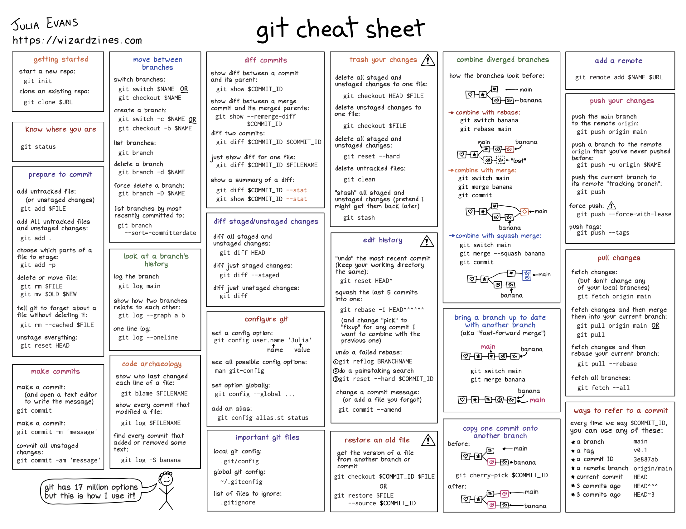

Uma das maiores dificuldades quando começamos utilizar versionamento
    em nossos trabalhos é a quantidade de termos técnicos utilizados
    nessa área. *Pull*, *push*, *commit*, *pull request*, *merge*, *fast forward*,
    *main/origin* e por aí vai. 

Por isso, o objetivo dessa seção é compilar um conjunto de termos e seus 
    significados para facilitar o entendimento dos procedimentos de versionamento.
Muitos dos significados são retirados do ótimo artigo [Pedro Braga na Methods
    in Ecology and Evolution](https://besjournals.onlinelibrary.wiley.com/doi/epdf/10.1111/2041-210X.14108) (@bragaNotJustProgrammers2023).
    Nessa seção você pode encontrar os principais termos utilizados em trabalhos
    que envolvem versionamento. Para sugestões, correções ou adições de termos
    abra um [*Issue*]() ou submeta um *pull request*. Os termos estão colocados
    em inglês pois é a maneira mais comum que vocês irão encontrar na documentação
    do Git e do GitHub.
    
::: {.callout-note collapse="true"}
## Glossário

* **Repository:** Um conjunto de arquivos que é monitorado pelo Git (nossa
    ferramenta de versionamento). Os repositórios podem ser tanto remotos 
    quanto locais, dependendo de onde eles estão (respectivamente, em um 
    serviço de hospedagem remoto, como o GitHub ou/e no seu computador)
* **Branch:** Representa o caminho de desenvolvimento do projeto. Repositórios
    podem ter um único, geralmente denominado *main* ou *master*, ou múltiplos
    branches. Esses multiplos branches podem representar caminhos divergentes de
    um dado projeto (por exemplo, uma modificação em análises, um colaborador
    que está testando uma mudança em algum aspecto do projeto, etc.). O uso 
    prático dos branches está ilustrado em [Trabalho colaborativo]()
* **Commit:** Função do Git que possibilita registrar "fotografias" que representam
    diferentes momentos do desenvolvimento do projeto. No versionamento com o 
    Git os commits possibilitam a identificação e o rastreamento das modificações
    realizadas no repositório. O uso prático do commit está ilustrado em 
    [ABC do versionamento]()
* **Push e Pull:**
* **Pull request:**
* **Merge:** 
* **Release:**
* **Head:** Termo utilizado para representar qual o local atual que você se
    encontra no histórico de desenvolvimento do seu repositório. 
:::

# Guia resumido de funções do git

Aqui você pode encontrar uma pequena cola com algumas das principais funções
    do git. Este material foi produzido por [Julia Evans](https://jvns.ca/blog/2024/04/25/new-zine--how-git-works-/)

```{r echo=FALSE,eval=TRUE,fig.cap="cheat-sheet-git"}

```